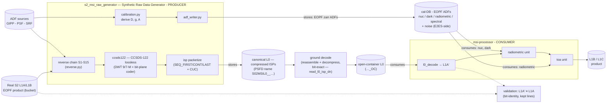

# Sentinel-2 MSI Synthetic Raw Data Generator (`s2_msi_raw_generator`)

End-to-End performance Simulator for Sentinel-2 MSI — the **reverse / forward-instrument
conjugate** of the `msi-processor` (L0c→L2A). It degrades a  Sentinel-2 **L1A/L1B** product
back to a synthetic **L0 RAW** product (focal-plane DN, 12 detectors × 13 bands), for:

1. **RAW generation** — realistic L0 RAW when true Sentinel-2 L0 is unavailable.
2. **Round-trip V&V** — an original radiometric round-trip on a **L1A** with the **real
   operational GIPP**: raw `X` → forward correction (dark + equalization) → `Y` → reverse impress →
   `X′`. The residual `X′ − X` ≈ 0 (verified to ~1e-14 on S2 DN) proves the forward and reverse
   are exact inverses. Built from the public L1 ATBD — no external processor.
3. **Real-L1B → L1A → L0plus → L0 ladder** — the exact inverse of the *full* operational L0→L1B
   radiometric chain (offset, relative response, on-board equalization, dark, binning, **SWIR
   re-arrangement**, defective, crosstalk), materialised as the full EOPF product ladder: a real S2B
   L1B → synthetic **L1A** → **L0plus** (CCSDS ISP) → **L0** (decoded `img`), agreeing with the original S2B
   L0 to **≤ ~4 DN on the ten 10 m + 20 m bands** (the three native-60 m bands are un-bin-limited)
   ([see below](#reverse-l1b--l1a--l0plus--l0-full-ladder--real-data-validation)).

**Scope:** radiometric-only, 14-step chain (S1 radiance→DN … S15 ISP packets); input is
L1A/L1B, already in per-detector sensor geometry, so there is no geometry inversion (Issue #17).
An L1C entry + geometry reverse was considered and **cancelled** — with an L1A/L1B entry there is
no orthorectification to undo.

## Workflow

The generator is the **producer** in an end-to-end loop: it degrades a real L1A/L1B into a synthetic
**L0 RAW** product *and* derives a **calibration database** (EOPF ADFs) that the downstream
`msi-processor` (its L1PP blocks) consumes to invert the chain. Who produces/consumes what, the
input/output data, and where it is stored:



All chain products live under one **data-store** root (`l0/`, `caldb/`, `l1b/`, `quicklook/`;
real-data runs add `inputs/`, `l1a_prime/`, `report/`) with **EOPF PSFD §3** file names
(ICD-IF-NAME). The real-data end-to-end (bucket L1A → compressed-ISP L0 → `l0_decode` → L1A′ →
bit-identity validation + real-L0 structural comparison) is driven by
`scripts/run_pipeline.py` (see `docs/vv/real_e2e.md`).

The processor keeps calibration *internal* (a mode of its radiometric unit); the generator only
supplies the ADF — a single shared sensor-model ADF, one source of truth. Build it with
the pipeline's `build-caldb` phase (see Usage). Coefficients are **derived** (diffuser + dark), not the truth
ADF, so the round-trip is non-tautological.

## Result

**Real-data run (SDE, 2026-07-02):** the public-bucket **real L1A** packaged as a
CCSDS-122-compressed, real-space-packet **L0** (lossless ratio **3.66×**, 30 642 CCSDS
packets), ground-decoded bit-exactly and pushed through msi-processor `l0_decode` —
**L1A′ bit-identical to the original in 13/13 bands**; radiometric GIPP round-trip
RMSE ≈ 1e-14. Numbers & criteria: `docs/vv/real_e2e.md`; products: GitLab package registry
`e2e-real/0.3.0` (PSFD `.zarr.zip` names).


### Single band, stage by stage — B04, real product

What the generator actually *does* to one band (B04, detector d07, 650 lines of the real
Sentinel-2 L1B granule): the ideal DN image, the same image after the instrument effects are
impressed (PSF re-blur → PRNU → noise → dark → onboard equalization, chain steps S6–S13),
and the generated 12-bit RAW L0. Zoomed crops (256×256 cloud edge, 2×) show the texture
changes; each panel is independently 2–98 % percentile-stretched, so what changes between
panels is the texture, not the display range.

| original — ideal DN (S1) | effects impressed (S6–S13) | RAW L0 DN (S14, uint16) |
|---|---|---|
|  |  |  |

Full 2552 × 650 strips: [original](docs/_static/showcase/result_b04_original.png) ·
[effects](docs/_static/showcase/result_b04_effects.png) ·
[raw](docs/_static/showcase/result_b04_raw.png) ·
[impressed-noise field](docs/_static/showcase/result_b04_delta.png) (the S13 noise alone —
its brightness follows the signal, σ=√(α²+β·DN)).

| Stage | DN min | DN max | mean | std | SNR (dB) | entropy (bits/px) |
|---|---|---|---|---|---|---|
| original — ideal DN (S1) | 1103.5 | 10486.9 | 1362.8 | 645.03 | 6.5 | 5.36 |
| effects impressed (S6–S13) | 1577.3 | 10880.9 | 1843.1 | 642.19 | 9.2 | 8.14 |
| RAW L0 DN (S14, uint16) | 1577.0 | 4095.0 | 1807.5 | 356.23 | 14.1 | 7.95 |

| Quality figure | Value |
|---|---|
| PSF re-blur RMSE vs ideal DN (S6) | 25.52 DN |
| impressed noise σ — measured vs model √(α²+β·DN) | 7.44 vs 7.34 DN (**+1.4 %**) |
| saturated px clipped by S14 (DN > 4095, bright cloud cores) | 1.53 % |
| quantization RMSE, unsaturated px (theory 1/√12 ≈ 0.29) | **0.29 DN** |
| full-chain radiance recovery (fwd(RAW) vs input), unsaturated px | RMSE 3.06 · **PSNR 45.1 dB** · bias +0.02 % |

Reading the numbers: the impressed noise matches the product noise model to 1.4 %; the
quantization error is exactly the uniform-quantizer theory value; recovering radiance from the
generated RAW returns the input to 45 dB with a +0.02 % bias — the only irreversible losses are
the modelled ones (noise, 12-bit clipping of the saturated cloud cores, quantization). The DN
pedestal (mean 1363 → 1843) is the re-applied dark signal + onboard equalization. Reproduce
locally (numpy+zarr only): `S2_E2ES_PHASES=figures S2_E2ES_L1B=<L1B.zarr[.zip]> python scripts/run_pipeline.py`. In this run
the PSF/SRF/noise model are real S2B data; the per-pixel dark/PRNU are the synthetic fallback
(set `S2_E2ES_GIPP_DIR=<dir>` for the operational-GIPP versions).

## Reverse L1B → L1A → L0plus → L0 (full ladder) — real-data validation

The generator's headline capability is the **exact reverse of the operational L0→L1B radiometric
chain**, materialised as the **full EOPF product ladder** (the canonical forward chain
`L0 → L0plus → L1A → L1B` run backwards): given a real S2B **L1B** (digital counts),
`forward_radiometric_atbd.reverse_l1b_to_l0` reconstructs the raw counts by inverting *every* ON
forward step, and the pipeline persists each product level:

- **L1A** (`reverse-l1b` phase → `import_l0.write_l1a_product`): decompressed raw counts,
  `measurements/DD{dd}/{BAND}/l1a_raw_image` — the same layout the real EOPF L1A/L0-`img` carries.
- **L0plus** (`package-l0` phase → `l0product.write_l0_product`, `S2MSIL0plus`): CCSDS-122 lossless ISP
  + `conditions/ancillary_data` SAD/datation — the processing-ready, *as-downlinked* form.
- **L0** (`package-l0` → `l0product.write_l0_decoded_product`, `S02MSIL0_`): the L0plus ISP decoded back
  to `measurements/d{DD}/b{BB}/img` + decode-quality attrs — **format-identical to the original S2B
  `S02MSIL0__…` product** (verified against the 2024-04-08 TC7D granule), for a direct array comparison.

`validate-reverse` compares the synthetic L1A against the **original S2B L0 `img`** directly (no decoding —
the archived EOPF L0 already stores decompressed `img`), framing-aligned to the ADF_PRDLO co-registration
crop. Validated on the real **2024-04-08 S2B PPB** L0/L1B pair (detector d05):

| Forward step | Reverse op | ADF / GIPP |
|---|---|---|
| radiometric offset | `+ RADIO_ADD_OFFSET` (−100) | R2PARA |
| binning (60 m) | ×3 un-bin (replication) | — |
| defective pixels | re-stamp NoData | R2DEPI |
| **SWIR re-arrangement** | **re-introduce staggered readout** | **RSWIR** |
| relative response | impress `G⁻¹` (cubic VNIR / bilinear SWIR) | R2EQOG |
| crosstalk | add back (phase-level, same-res groups) | RCRCO |
| dark | `+` L0-domain dark × DSNU shape | R2EQOG COEFF_D |
| on-board equalization | re-apply bilinear non-linearity | REOB2 |

**MTF restoration / deconvolution (forward step 8) is off in the operational chain** (SentiWiki:
*"restoration disabled by default — instrument MTF already high"*; `feature_flag_with_deconvolution =
False`). L1B therefore keeps the full instrument PSF, so PSF re-blur (S6) and noise (S13) are **not**
re-applied — they would double-count (both are non-invertible anyway). See `docs/dpm/parameters-data-list.md`.

**Synthetic L1A vs original ESA L0 `img` — all 13 bands, detector d05, framing-aligned (drift 0):**

| band | B01 | B02 | B03 | B04 | B05 | B06 | B07 | B08 | B8A | B09 | B10 | B11 | B12 |
|---|---|---|---|---|---|---|---|---|---|---|---|---|---|
| RMSE (DN) | *149.6* | 0.8 | 1.5 | 1.8 | 1.1 | 1.0 | 0.9 | 0.8 | 1.1 | *96.9* | *22.0* | **4.2** | **3.9** |
| resolution | 60 m | 10 m | 10 m | 10 m | 20 m | 20 m | 20 m | 10 m | 20 m | 60 m | 60 m | 20 m | 20 m |

All **ten 10 m + 20 m bands agree to ≤ ~4 DN**. The three *native-60 m* bands (**B01/B09/B10**, italic) have
higher RMSE because the reverse un-bin is a ×3 line replication — the sub-pixel detail the forward 60 m
binning averaged away is **irrecoverable** (median offsets stay small: 0.7–5.9 %). Regenerate the table +
figure with `scripts/reverse_compare_figure.py`.


> *The "original S2B L0" panels above contain **modified Copernicus Sentinel data 2024** (Sentinel-2B,
> 2024-04-08 datatake), used here for validation and shown as low-resolution demo previews only — no raw
> product data is redistributed in this repository. Input products (L0/L1B) and operational GIPP/ADF are
> ESA/Copernicus assets held in the `ipf/data-store`, not in git.*

The **S8 SWIR re-arrangement** is decisive for B11/B12 — re-introducing the staggered detector readout
drops their residual from ~50 DN of stripe texture to ~3 DN (the diff panels go from noisy to flat):


Run the full ladder:
`S2_E2ES_PHASES=reverse-l1b,package-l0,validate-reverse S2_E2ES_L1B=<L1B.zarr> S2_E2ES_REAL_L0=<L0.zarr> python scripts/run_pipeline.py`
(auto-finds the RSWIR/REOB2/RCRCO ADFs next to `$S2_E2ES_EQOG_ADF`; `S2_E2ES_REVERSE_FULL=0` →
radiometric-only; `S2_E2ES_JOBS=1` on NFS-backed stores). `validate-reverse` needs the real L0
(`$S2_E2ES_REAL_L0`) and the ADF_PRDLO framing offsets (`$S2_E2ES_FRAMING` or auto-found under
`esa-source/aux/framing/`, else read from the L1B metadata) for the line-aligned comparison. Visual
compare (all 13 bands): `notebooks/reverse_l1b_compare.ipynb`.

## Package

| Module | Responsibility |
|---|---|
| `s2_msi_raw_generator/sensor.py` | S2 band model — per-band gains/TDI/Lref/integration-time (datasheet) |
| `s2_msi_raw_generator/adf.py` | ADFs — **real** ESA PSF matrices (`data/psf/`) + SRF spectral + SNR@Lref noise; PRNU/dark from the operational GIPP (`BandADF.from_gipp`) |
| `s2_msi_raw_generator/gipp.py` | Original reader for the operational **GIPP** (R2EQOG dark+gains, R2DEPI, BLINDP, R2PARA, R2CRCO) **+ EOPF ADF parsers** for the full reverse chain (RSWIR shift map, REOB2 on-board eq, RCRCO 13×13 crosstalk) |
| `s2_msi_raw_generator/forward_radiometric_atbd.py` | Public-ATBD forward radiometric model + exact inverse (round-trip V&V), and **`reverse_l1b_to_l0`** — the full real-L1B→L0 reverse (offset/PRNU/dark/un-bin **+ S8 SWIR re-stage + S10 defective + S12 on-board eq**) |
| `s2_msi_raw_generator/calibration.py` | S2 calibration sub-set — synthetic CSM sun-diffuser + dark → **derived** gain/dark coeffs (inverse-crime cure) |
| `s2_msi_raw_generator/reverse.py` | Reverse chain steps **S1–S14** + `reverse_full` / `reverse_mvp` |
| `s2_msi_raw_generator/isp.py` | **S15** — CCSDS ISP packet generation + SAD telemetry |
| `s2_msi_raw_generator/io.py` | Real EOPF L1A/L1B Zarr reader (`zarr`) |
| `s2_msi_raw_generator/import_l0.py` | Public L0 → PDI-style L1A bridge (`import-l0`) **+ `write_l1a_product`** — the reverse ladder's materialised L1A writer (`reverse-l1b` phase) |
| `s2_msi_raw_generator/inventory.py` | Metadata-only data-store inventory + consistency report (`inventory` phase) |
| `s2_msi_raw_generator/l0product.py` | L0 RAW EOProduct assembly (156-array Zarr + STAC/sensor-config + ISP) |
| `s2_msi_raw_generator/adf_writer.py` | **Calibration database** — writes derived coeffs as EOPF ADFs (`nuc`/`dark`/`radiometric`/`spectral`/`noise`) for the downstream L1PP processor |

## Documentation

Full **ECSS-E-ST-40C Rev.1** software documentation set under `docs/` (tailored for a single-CSC E2ES):

| DRD | File | Content |
|---|---|---|
| ATBD | `docs/atbd/atbd.md` | Algorithm theoretical basis — S1–S15 chain + Annex A datasheet (issued v1.0) |
| SRS | `docs/srs.md` | Requirements (REQ-FUNC/PERF/IF/QUAL) + verification methods |
| SDD | `docs/sdd/` | Software design — architecture, module design, REQ→code→test traceability |
| ICD | `docs/icd.md` | Interfaces — L1A/L1B + GIPP inputs, the L0 RAW output (ICD-IF-L0) |
| DPM | `docs/dpm/` | Data processing model — the reverse chain blocks + parameter/data list |
| V&V | `docs/vv/` | Verification & validation plan + report (201 tests at v0.3.0, RMSE ~1e-14; real-data E2E: vv/real_e2e) |
| SUM | `docs/sum.md` | User manual — install, usage, CLI |
| SRN | `docs/srn.md` | Release note |
| CIDL / SCF / SRF / SDP | `docs/{cidl,scf,srf,sdp}.md` | Config item list, config file, reuse file, development plan |

**CHANGELOG** — `CHANGELOG.md`. **License** — `LICENSE` (Apache-2.0). All instrument data is real
ESA-sourced (official PSF, SRF, product noise model, operational GIPP) — nothing fitted or synthetic;
implemented from public references only.

## Usage

```bash
pip install -e ".[read]"                 # numpy + zarr (eopf not required)
pytest                                   # full suite
```

Everything runs through the **single pipeline driver** `scripts/run_pipeline.py`
(phase-structured, idempotent; all product names PSFD §3). The CLI takes **only the mode** —
the store root is `$S2_DATA_STORE` (default `~/data-store`) and every knob is an
`S2_E2ES_*` environment variable:

```bash
# nominal mode (default): real S2 product → synthetic RAW downlink → <store>/l0/
# (fetch → package → ground-decode → l0_decode → validate → report)
python scripts/run_pipeline.py

# calibration mode: dark (DASC) + sun-diffuser (ABSR) campaign acquisitions packaged as
# REAL downlink L0 products (S02MSIDCA / S02MSISCA, compressed ISPs) + Option-Y cal-DB,
# everything → <store>/caldb/
python scripts/run_pipeline.py calibration

# shared data-store (ipf/data-store registry): pull / push the product DB
S2_E2ES_PHASES=fetch-store python scripts/run_pipeline.py
S2_E2ES_PHASES=publish-store S2_E2ES_PUBLISH_VERSION=<X.Y.Z> python scripts/run_pipeline.py

# on-demand phases
S2_E2ES_PHASES=inventory python scripts/run_pipeline.py                        # INVENTORY.md + report/inventory.json
S2_E2ES_PHASES=import-l0,preflight,package,ground-decode,l0-decode,validate,report \
  S2_E2ES_PUBLIC_L0=<S02MSIL0__.zarr.zip> python scripts/run_pipeline.py        # same-scene bridge
S2_E2ES_PHASES=build-caldb python scripts/run_pipeline.py                        # Option-Y cal-DB ADFs
S2_E2ES_PHASES=derive-adf S2_E2ES_L1A=<L1A.zarr> python scripts/run_pipeline.py  # real PRNU/dark → npz
S2_E2ES_PHASES=figures S2_E2ES_L1B=<L1B.zarr.zip> python scripts/run_pipeline.py # Result figures
```

The GIPP folder holds the `S2A_OPER_GIP_*.xml` files (R2EQOG ×13, R2DEPI, BLINDP, R2PARA,
R2CRCO); the L1A is an EOPF L1A Zarr (`measurements/DDnn/Bxx/l1a_raw_image`). Products and inputs
live in the shared [ipf/data-store](https://gitlab.eopf.copernicus.eu/ipf/data-store) registry —
pull a working copy with `S2_E2ES_PHASES=fetch-store`. Real-data tests run
when `S2_E2ES_GIPP_DIR` / `S2_E2ES_L1A` are set. The full variable reference is in
`docs/sum.md` §4. For interactive inspection of the generated products (band images, ISP
decode checks, cal-DB gains, reports) open `notebooks/inspect_products.ipynb` in JupyterLab;
for a tabular store inventory use `notebooks/data_inventory.ipynb`.

## Status

**Complete — full S1–S15 reverse chain (incl. CCSDS-122 compressed ISPs), real-data E2E validated (L1A′ bit-identical 13/13); 201 tests, CI green.**

| Increment | Content |
|---|---|
| 0 | Scaffold, CI, ATBD + Annex A datasheet |
| 1 | MVP radiometric core (S1, S6, S7, S11–S14) + sensor model +S2 PSF / SRF ADFs |
| 2 | L0 RAW EOProduct assembly (156-array Zarr) |
| 3 | S3/S4/S5/S8/S9/S10 (framing, offset, binning, SWIR re-arrangement (reverse), crosstalk, defects) |
| 4 | S15 CCSDS ISP packet generation + SAD telemetry |
| 5 | Real per-band noise model (α,β) + official ATBD raw model (`X=A·G·L+D`), DQR dark |
| 6 | Real operational **GIPP** → per-pixel dark + relative response (`gipp.py`, `from_gipp`) |
| 7 | Original ATBD forward + **round-trip V&V on L1A** (RMSE ~1e-14) |
| 8 | S2 **calibration sub-set** — CSM diffuser + dark → derived coeffs (inverse-crime cure) |
| 9 | **L0 completion → L0→L1B E2E** — ESUN spectral ADF, real datation, STAC geometry/orbit + orbit-ephemeris, real SAD (AOCS/orbit/thermal), QAFlag/MSK_QUALIT quality + EOQC report, open-container handoff to `msi-processor` |

**All radiometric ADFs are real** (official ESA PSF, SRF, product noise model, operational GIPP) —
nothing fitted or synthetic. Runs end-to-end on S2 L1A/L1B with `numpy` + `zarr` only.
EOPF CPM 2.8.1, ECSS-E-ST-40C. The L1C-entry + geometry-reverse module is cancelled (not applicable
to an L1A/L1B entry).
