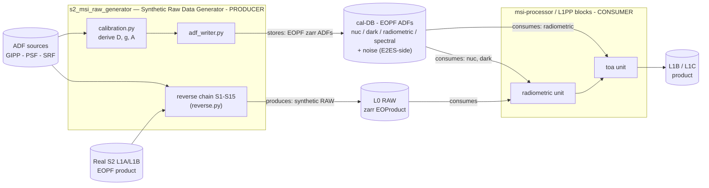

# Sentinel-2 MSI Synthetic Raw Data Generator (`s2_msi_raw_generator`)

End-to-End performance Simulator for Sentinel-2 MSI — the **reverse / forward-instrument
conjugate** of the `msi-processor` (L0c→L2A). It degrades a  Sentinel-2 **L1A/L1B** product
back to a synthetic **L0 RAW** product (focal-plane DN, 12 detectors × 13 bands), for:

1. **RAW generation** — realistic L0 RAW when true Sentinel-2 L0 is unavailable.
2. **Round-trip V&V** — an original radiometric round-trip on a **L1A** with the **real
   operational GIPP**: raw `X` → forward correction (dark + equalization) → `Y` → reverse impress →
   `X′`. The residual `X′ − X` ≈ 0 (verified to ~1e-14 on S2 DN) proves the forward and reverse
   are exact inverses. Built from the public L1 ATBD — no external processor.

**Scope:** radiometric-only, 14-step chain (S1 radiance→DN … S15 ISP packets); input is
L1A/L1B, already in per-detector sensor geometry, so there is no geometry inversion (Issue #17).
An L1C entry + geometry reverse was considered and **cancelled** — with an L1A/L1B entry there is
no orthorectification to undo.

## Workflow

The generator is the **producer** in an end-to-end loop: it degrades a real L1A/L1B into a synthetic
**L0 RAW** product *and* derives a **calibration database** (EOPF ADFs) that the downstream
`msi-processor` (its L1PP blocks) consumes to invert the chain. Who produces/consumes what, the
input/output data, and where it is stored:



The processor keeps calibration *internal* (a mode of its radiometric unit); the generator only
supplies the ADF — a single shared sensor-model ADF, one source of truth. Build it with
`scripts/build_cal_db.py` (see Usage). Coefficients are **derived** (diffuser + dark), not the truth
ADF, so the round-trip is non-tautological.

## Package

| Module | Responsibility |
|---|---|
| `s2_msi_raw_generator/sensor.py` | S2 band model — per-band gains/TDI/Lref/integration-time (datasheet) |
| `s2_msi_raw_generator/adf.py` | ADFs — **real** ESA PSF matrices (`data/psf/`) + SRF spectral + SNR@Lref noise; PRNU/dark from the operational GIPP (`BandADF.from_gipp`) |
| `s2_msi_raw_generator/gipp.py` | Original reader for the operational S2A **GIPP** (R2EQOG per-pixel dark+gains, R2DEPI, BLINDP, R2PARA, R2CRCO) |
| `s2_msi_raw_generator/forward_radiometric_atbd.py` | Public-ATBD forward radiometric model + exact inverse (round-trip V&V on the L1A) |
| `s2_msi_raw_generator/calibration.py` | S2 calibration sub-set — synthetic CSM sun-diffuser + dark → **derived** gain/dark coeffs (inverse-crime cure) |
| `s2_msi_raw_generator/reverse.py` | Reverse chain steps **S1–S14** + `reverse_full` / `reverse_mvp` |
| `s2_msi_raw_generator/isp.py` | **S15** — CCSDS ISP packet generation + SAD telemetry |
| `s2_msi_raw_generator/io.py` | Real EOPF L1A/L1B Zarr reader (`zarr`) |
| `s2_msi_raw_generator/l0product.py` | L0 RAW EOProduct assembly (156-array Zarr + STAC/sensor-config + ISP) |
| `s2_msi_raw_generator/adf_writer.py` | **Calibration database** — writes derived coeffs as EOPF ADFs (`nuc`/`dark`/`radiometric`/`spectral`/`noise`) for the downstream L1PP processor |

## Documentation

Full **ECSS-E-ST-40C Rev.1** software documentation set under `docs/` (tailored for a single-CSC E2ES):

| DRD | File | Content |
|---|---|---|
| ATBD | `docs/atbd/atbd.md` | Algorithm theoretical basis — S1–S15 chain + Annex A datasheet (issued v1.0) |
| SRS | `docs/srs.md` | Requirements (REQ-FUNC/PERF/IF/QUAL) + verification methods |
| SDD | `docs/sdd/` | Software design — architecture, module design, REQ→code→test traceability |
| ICD | `docs/icd.md` | Interfaces — L1A/L1B + GIPP inputs, the L0 RAW output (ICD-IF-L0) |
| DPM | `docs/dpm/` | Data processing model — the reverse chain blocks + parameter/data list |
| V&V | `docs/vv/` | Verification & validation plan + report (127 tests, RMSE ~1e-14) |
| SUM | `docs/sum.md` | User manual — install, usage, CLI |
| SRN | `docs/srn.md` | Release note |
| CIDL / SCF / SRF / SDP | `docs/{cidl,scf,srf,sdp}.md` | Config item list, config file, reuse file, development plan |

**CHANGELOG** — `CHANGELOG.md`. **License** — `LICENSE` (Apache-2.0). All instrument data is real
ESA-sourced (official PSF, SRF, product noise model, operational GIPP) — nothing fitted or synthetic;
implemented from public references only.

## Usage

```bash
pip install -e ".[read]"                 # numpy + zarr (eopf not required)
pytest                                   # 127 tests
```

**Reverse chain → L0 RAW** (on a  L1B granule):

```bash
python scripts/demo_reverse_real.py <L1B.zarr.zip> 4 B03   # reverse one band
python scripts/demo_build_l0.py                            # assemble a synthetic L0 RAW product
```

**Real-data V&V with the operational GIPP** — point at the GIPP folder + a L1A:

```bash
# round-trip V&V (forward → reverse == identity on  DN, ~1e-14 RMSE)
python scripts/roundtrip_real_l1a.py <L1A.zarr> <GIPP_dir> B02 B03 B11 B12

# calibration sub-set: synthetic diffuser + dark → derived dark/gain (inverse-crime cure)
python scripts/demo_calibration.py <GIPP_dir>

# calibration database (EOPF ADFs) for the downstream L1PP processor (Option Y coupling)
python scripts/build_cal_db.py caldb        # writes nuc/dark/radiometric/spectral/noise .zarr + PROVENANCE.md

# save viewable images (bit-exact .npy + uint8 .png) of raw / corrected / residual / calib
python scripts/save_images.py <L1A.zarr> <GIPP_dir> B03 --out images
```

The GIPP folder holds the `S2A_OPER_GIP_*.xml` files (R2EQOG ×13, R2DEPI, BLINDP, R2PARA,
R2CRCO); the L1A is an EOPF L1A Zarr (`measurements/DDnn/Bxx/l1a_raw_image`). Data lives under a
gitignored `data/` (or pass any path). Real-data tests run when `S2_E2ES_GIPP_DIR` / `S2_E2ES_L1A`
are set.

## Status

**Complete — full S1–S15 reverse chain, all- ADFs, original round-trip V&V; 127 tests, CI green.**

| Increment | Content |
|---|---|
| 0 | Scaffold, CI, ATBD + Annex A datasheet |
| 1 | MVP radiometric core (S1, S6, S7, S11–S14) + sensor model +S2 PSF / SRF ADFs |
| 2 | L0 RAW EOProduct assembly (156-array Zarr) |
| 3 | S3/S4/S5/S8/S9/S10 (framing, offset, binning, SWIR re-arrangement (reverse), crosstalk, defects) |
| 4 | S15 CCSDS ISP packet generation + SAD telemetry |
| 5 | Real per-band noise model (α,β) + official ATBD raw model (`X=A·G·L+D`), DQR dark |
| 6 | Real operational **GIPP** → per-pixel dark + relative response (`gipp.py`, `from_gipp`) |
| 7 | Original ATBD forward + **round-trip V&V on L1A** (RMSE ~1e-14) |
| 8 | S2 **calibration sub-set** — CSM diffuser + dark → derived coeffs (inverse-crime cure) |

**All radiometric ADFs are real** (official ESA PSF, SRF, product noise model, operational GIPP) —
nothing fitted or synthetic. Runs end-to-end on S2 L1A/L1B with `numpy` + `zarr` only.
EOPF CPM 2.8.1, ECSS-E-ST-40C. The L1C-entry + geometry-reverse module is cancelled (not applicable
to an L1A/L1B entry).
