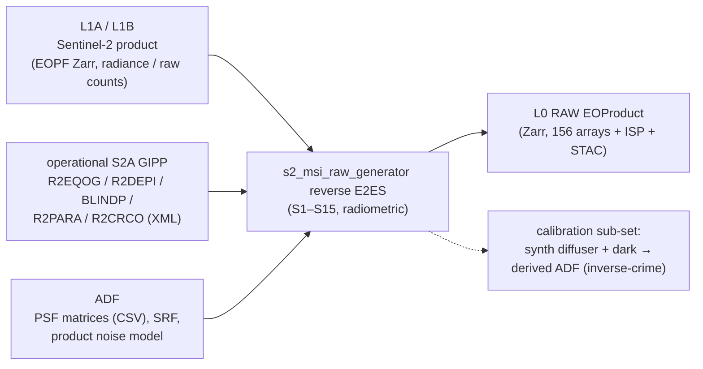
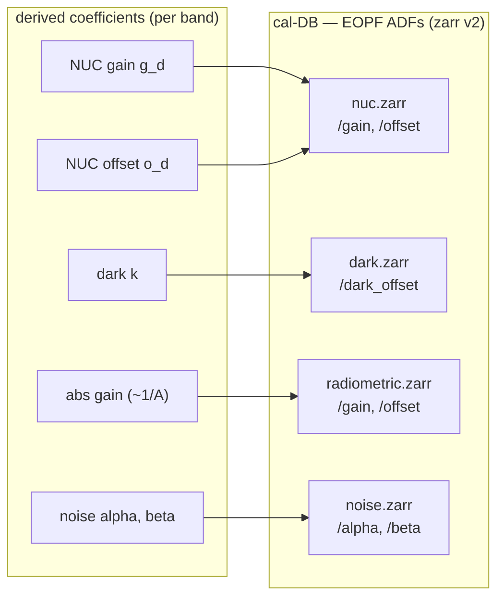

<!--
  Copyright 2026 Can Deniz Kaya

  Licensed under the Apache License, Version 2.0 (the "License");
  you may not use this file except in compliance with the License.
  You may obtain a copy of the License at

    http://www.apache.org/licenses/LICENSE-2.0

  Unless required by applicable law or agreed to in writing, software
  distributed under the License is distributed on an "AS IS" BASIS,
  WITHOUT WARRANTIES OR CONDITIONS OF ANY KIND, either express or implied.
  See the License for the specific language governing permissions and
  limitations under the License.
-->

# Context overview

**Inputs.** A Sentinel-2 **L1A** (raw DN) or **L1B** (radiance) EOPF Zarr granule; the operational
S2A **GIPP** (per-pixel dark + relative response, defects, offsets, crosstalk); packaged ADFs (ESA
**PSF** matrices, **SRF** spectral characterisation, per-band **noise** model $\alpha,\beta$).

**Processing.** The reverse chain (S1–S15) impresses the instrument effects to reconstruct
focal-plane counts. A separate **calibration sub-set** synthesises sun-diffuser + dark acquisitions and
*derives* the calibration coefficients back — the coefficients a downstream processor would actually use
(inverse-crime cure).

**Output.** A synthetic **L0 RAW** EOProduct (the ICD-IF-L0 Zarr: 156 detector/band frames, quality masks,
optional CCSDS ISP telemetry, STAC + sensor-configuration metadata).

**Verification context.** The radiometric round-trip (`raw → forward correct → reverse impress → raw′`)
on a L1A with the GIPP confirms the forward and reverse are exact inverses (residual $\approx 0$).

## Calibration database (ADF output)

Besides the L0 RAW product, the generator also *derives* the radiometric calibration coefficients and
writes them as a versioned set of EOPF **Auxiliary Data Files** — the **calibration database** — that
the downstream processor (the L1PP blocks of `msi-processor`) consumes directly. This is the single
shared sensor-model ADF of the E2ES ⇄ processor coupling: the generator produces the ADF; the
processor keeps calibration internal. Coefficients are **derived** (synthetic diffuser + dark), not the
truth ADF, so the round-trip is non-tautological.

The NUC `gain`/`offset` follow the processor's two-point convention (`estimate_nuc`); the absolute
`radiometric.gain` is diffuser-derived ($\approx 1/\mathrm{cal\_gain}$). Written by `s2_msi_raw_generator.adf_writer`
(`scripts/build_cal_db.py`); `noise.zarr` (RNOMO) is E2ES-side and not read by the processor.
