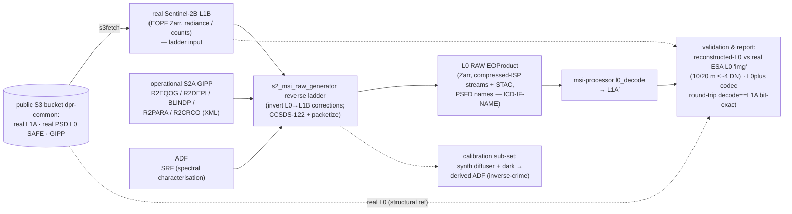
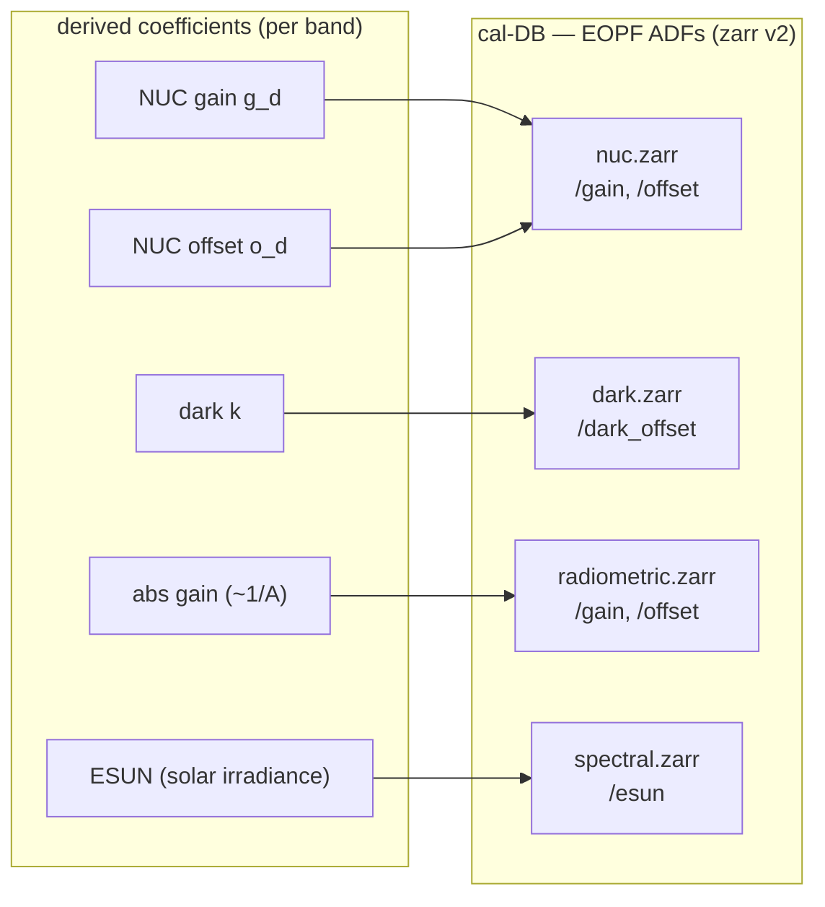

<!--
  Copyright 2026 Can Deniz Kaya

  Licensed under the Apache License, Version 2.0 (the "License");
  you may not use this file except in compliance with the License.
  You may obtain a copy of the License at

    http://www.apache.org/licenses/LICENSE-2.0

  Unless required by applicable law or agreed to in writing, software
  distributed under the License is distributed on an "AS IS" BASIS,
  WITHOUT WARRANTIES OR CONDITIONS OF ANY KIND, either express or implied.
  See the License for the specific language governing permissions and
  limitations under the License.
-->

# Context overview

**Inputs.** The primary input is a **real Sentinel-2B L1B** (radiance / counts) EOPF Zarr granule; the
operational S2A **GIPP** (per-pixel dark + relative response/PRNU, defects, offsets, crosstalk,
on-board-eq); and the **SRF** for spectral characterisation. L1A is not an input — it is an intermediate
the ladder *produces* on the way down to L0.

**Processing.** The reverse ladder runs the real L1B backwards through the **exact inverse** of the
operational L0→L1B radiometric correction chain — invert offset, relative-response/PRNU, dark, un-bin,
SWIR re-stage, defective, crosstalk, on-board-eq — to reconstruct **L1A → L0plus → L0**. MTF-deconvolution
is OFF, so PSF and noise are **not** re-applied. A separate **calibration sub-set** synthesises
sun-diffuser + dark acquisitions and *derives* the calibration coefficients back — the coefficients a
downstream processor would actually use (inverse-crime cure).

**Output.** The reconstructed **L0 RAW** EOProduct (the ICD-IF-L0 Zarr: 156 detector/band frames, quality
masks, optional CCSDS ISP telemetry, STAC + sensor-configuration metadata); the ladder also emits the
**L1A** and **L0plus** (CCSDS-122 ISP) intermediates en route.

**Verification context.** The reconstructed **L0** is compared against the **real ESA L0 'img'**: the
10/20 m bands agree to **≤~4 DN**. As a supporting check, the **L0plus codec round-trip** is bit-exact —
`decode(L0plus) == L1A`.

## Calibration database (ADF output)

Besides the L0 RAW product, the generator also *derives* the radiometric calibration coefficients and
writes them as a versioned set of EOPF **Auxiliary Data Files** — the **calibration database** — that
the downstream processor (the L1PP blocks of `msi-processor`) consumes directly. This is the single
shared sensor-model ADF of the E2ES ⇄ processor coupling: the generator produces the ADF; the
processor keeps calibration internal. Coefficients are **derived** (synthetic diffuser + dark), not the
truth ADF, so the round-trip is non-tautological.

The NUC `gain`/`offset` follow the processor's two-point convention (`estimate_nuc`); the absolute
`radiometric.gain` is diffuser-derived ($\approx 1/\mathrm{cal\_gain}$); `spectral.zarr` carries the per-band
**ESUN** (Thuillier 2003, S2A — ATBD §A.3) the processor's `toa` unit needs for TOA reflectance. Written by
`s2_msi_raw_generator.adf_writer` (`s2_msi_raw_generator.caldb`, pipeline phase `build-caldb`).
