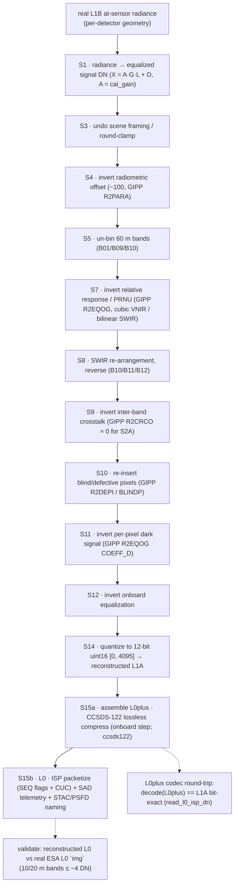

<!--
  Copyright 2026 Can Deniz Kaya

  Licensed under the Apache License, Version 2.0 (the "License");
  you may not use this file except in compliance with the License.
  You may obtain a copy of the License at

    http://www.apache.org/licenses/LICENSE-2.0

  Unless required by applicable law or agreed to in writing, software
  distributed under the License is distributed on an "AS IS" BASIS,
  WITHOUT WARRANTIES OR CONDITIONS OF ANY KIND, either express or implied.
  See the License for the specific language governing permissions and
  limitations under the License.
-->

# Introduction

This Data Processing Model (DPM) describes the processing chain of the Sentinel-2 MSI Synthetic Raw Data Generator
(`s2_msi_raw_generator`) — the **reverse ladder** that runs a real Sentinel-2B **L1B** product backwards
through the **exact inverse of the operational L0→L1B radiometric chain** (invert offset, relative-response/PRNU,
dark, un-bin, SWIR re-stage, defective, crosstalk, on-board equalization) to reconstruct **L1A → L0plus
(CCSDS-122 ISP) → L0**. MTF-deconvolution is **OFF**, so PSF and noise are **not** re-applied. Success is the
reconstructed L0 compared against the real ESA L0 `img` (10/20 m bands ≤ ~4 DN). It complements the ATBD
(`docs/atbd/atbd.md`, the per-step physics) and the SDD (`docs/sdd/`, the software structure).
DRD: ECSS-E-ST-40C Rev.1, tailored for an EOPF processor.

## Processing chain

The chain **inverts the operational L0→L1B radiometric chain** of the `msi-processor`, step by step, to
reconstruct focal-plane counts from a real L1B. It is **radiometric-only** (input is already in per-detector
sensor geometry). Because MTF-deconvolution is off, **no PSF re-blur and no noise are re-applied**; the ladder
runs the ordered inversion steps that reconstruct **L1A → L0plus → L0** (ATBD §5):

**Realized execution order.** `reverse.reverse_mvp` runs `S1 → S7 → S11 → S12 → S14` — the DN-domain
inversion steps that reconstruct the L1A focal-plane counts; **no PSF re-blur and no noise are re-applied**
(MTF-deconvolution off). `reverse.reverse_full` additionally inserts S8 (SWIR re-arrangement, reverse)
and S10 (defects) as genuine ladder steps. Verification is the **L0plus codec round-trip** — `decode(L0plus)`
reproduces the reconstructed L1A **bit-exactly** (`read_l0_isp_dn`) — and the comparison of the reconstructed
L0 against the real ESA L0 `img` (10/20 m bands ≤ ~4 DN).
