<!--
  Copyright 2026 Can Deniz Kaya

  Licensed under the Apache License, Version 2.0 (the "License");
  you may not use this file except in compliance with the License.
  You may obtain a copy of the License at

    http://www.apache.org/licenses/LICENSE-2.0

  Unless required by applicable law or agreed to in writing, software
  distributed under the License is distributed on an "AS IS" BASIS,
  WITHOUT WARRANTIES OR CONDITIONS OF ANY KIND, either express or implied.
  See the License for the specific language governing permissions and
  limitations under the License.
-->

# Introduction

This Data Processing Model (DPM) describes the processing chain of the Sentinel-2 MSI Synthetic Raw Data Generator
(`s2_msi_raw_generator`) — the algorithmic flow that turns a Sentinel-2 **L1A/L1B** product into a synthetic
**L0 RAW** product. It complements the ATBD (`docs/atbd/atbd.md`, the per-step physics) and the SDD
(`docs/sdd/`, the software structure). DRD: ECSS-E-ST-40C Rev.1, tailored for an EOPF processor.

## Processing chain

The chain is the **reverse / forward-instrument conjugate** of the `msi-processor`: where the forward
processor inverts instrument effects, the E2ES impresses the effects to reconstruct focal-plane
counts. It is **radiometric-only** (input is already in per-detector sensor geometry), 14 ordered
algorithm steps S1–S15 (ATBD §5):

```mermaid
flowchart TD
    IN["L1B at-sensor radiance<br/>(per-detector geometry)"]
    S1["S1 · radiance → equalized signal DN (X = A·G·L + D, A = cal_gain)"]
    S3["S3 · undo scene framing / round-clamp"]
    S4["S4 · remove radiometric offset (−100, GIPP R2PARA)"]
    S5["S5 · un-bin 60 m bands (B01/B09/B10)"]
    S6["S6 · PSF re-blur (ESA per-band/unit matrices; B10 = identity)"]
    S7["S7 · impress relative response / PRNU (GIPP R2EQOG, cubic VNIR / bilinear SWIR)"]
    S8["S8 · SWIR re-arrangement, reverse (B10/B11/B12)"]
    S9["S9 · re-apply inter-band crosstalk (GIPP R2CRCO ≈ 0 for S2A)"]
    S10["S10 · re-insert blind/defective pixels (GIPP R2DEPI / BLINDP)"]
    S11["S11 · re-apply per-pixel dark signal (GIPP R2EQOG COEFF_D)"]
    S12["S12 · reverse onboard equalization"]
    S13["S13 · add sensor noise σ = √(α² + β·DN) (product noise model)"]
    S14["S14 · quantize to 12-bit uint16 [0, 4095]"]
    S15a["S15a · CCSDS-122 lossless compress (onboard step; ccsds122)"]
    S15b["S15b · ISP packetize (SEQ flags + CUC) + SAD telemetry + STAC → L0 RAW"]
    GD["ground decode (L1A-side conjugate):<br/>reassemble packets → decompress bit-exact (read_l0_isp_dn)"]
    IN --> S1 --> S3 --> S4 --> S5 --> S6 --> S7 --> S8 --> S9 --> S10 --> S11 --> S12 --> S13 --> S14 --> S15a --> S15b
    S15b -.-> GD
```

**Realized execution order.** `reverse.reverse_mvp` runs `S1 → S6 → S7 → S13 → S11 → S12 → S14`: the
sensor noise (S13) is impressed on the *signal* DN **before** the S11 dark pedestal, so $\sigma = \sqrt{\alpha^2 + \beta \cdot \mathrm{DN}}$
reproduces the spec $\mathrm{SNR}@L_\mathrm{ref}$ exactly. `reverse.reverse_full` additionally inserts S8 (SWIR re-arrangement, reverse)
and S10 (defects). The exactly-invertible bridge `reverse_radiometric`/`forward_radiometric` uses only
S1, S7, S11, S12 (no PSF, noise, or quantization) for the round-trip V&V.
