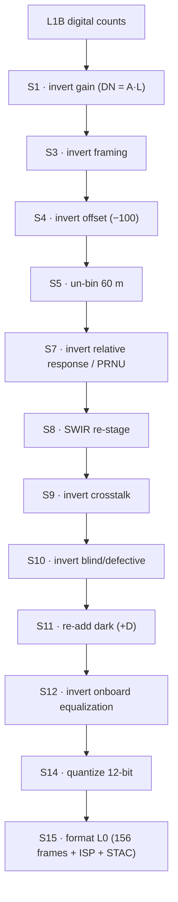
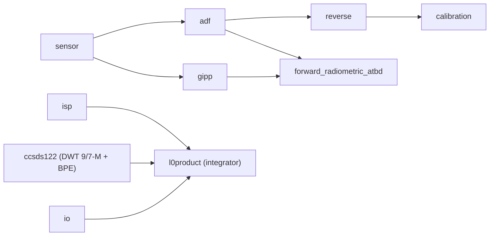

<!--
  Copyright 2026 Can Deniz Kaya

  Licensed under the Apache License, Version 2.0 (the "License");
  you may not use this file except in compliance with the License.
  You may obtain a copy of the License at

    http://www.apache.org/licenses/LICENSE-2.0

  Unless required by applicable law or agreed to in writing, software
  distributed under the License is distributed on an "AS IS" BASIS,
  WITHOUT WARRANTIES OR CONDITIONS OF ANY KIND, either express or implied.
  See the License for the specific language governing permissions and
  limitations under the License.
-->

# Software design overview

## Software static architecture

### Component view
The software is the single Python package `s2_msi_raw_generator` (one CSC). Modules:

| Module | Responsibility |
|---|---|
| `sensor.py` | Sentinel-2 sensor model — harvested constants: bands, GSD, physical gains, Lref/SNR, integration time, TDI/SWIR sets, per-unit SRF (centre/bandwidth/equivalent wavelength), dark pedestal, EQ-gain stability, quantization. `Band` dataclass (`.dn_ref`, `.cal_gain`, `.dark_dsnu`). |
| `gipp.py` | Parser for operational GIPP JSON (`aux/gipp-json`) → per-pixel arrays: REQOG (dark + cubic/bilinear relative-response gains), RDEPI (defective), BLIND (blind), RPARA (offsets/flags), RCRCO (crosstalk). XML fixtures retained for unit tests only. |
| `adf.py` | Per-band ADF assembly; builds `BandADF` `from_gipp` / `from_product` / `synthesize`. |
| `forward_radiometric_atbd.py` | Original implementation of the public L1 ATBD on-ground model $Z = X - D$, $Y = G(Z)$; the reverse chain applies its **exact inverse** (re-add dark $D$, invert gain $G$) to step L1B→L1A. |
| `reverse.py` | The radiometric inversion chain — one pure-NumPy function per ATBD §5 step, driving the `reverse_mvp` / `reverse_full` chains that reconstruct L1A→L0plus→Synthetic L0 from the S2 L1B with MTF-deconvolution and noise off. |
| `calibration.py` | In-flight two-reference calibration sub-set: synthesize CSM sun-diffuser + dark, derive the dark/relative-response/absolute coefficients back (inverse-crime cure). |
| `isp.py` | S15 — CCSDS Instrument Source Packet + SAD telemetry generation. |
| `io.py` | Lightweight `zarr` reader for EOPF L1A/L1B products (no full EOPF dependency). |
| `l0product.py` | Assembly of the Synthetic L0 RAW EOProduct Zarr (the ICD-IF-Synthetic L0) produced by the reverse chain from the S2 L1B. |

### Data flow
Entry is a Sentinel-2B **L1B** (digital counts, per-detector geometry). The reverse chain steps it
*backwards* through the operational L0→L1B chain — the **exact inverse** of each ATBD §5 radiometric
step — to reconstruct **L1A → L0plus → Synthetic L0**. MTF-deconvolution is OFF, so the PSF is **not** re-applied
and noise is **not** re-injected; the two forward-only stages (PSF re-blur, add noise) are absent:

The Synthetic L0 RAW is validated against the reference ESA L0 `img` (10/20 m bands agree within
≤ ~4 DN). The `reverse.reverse_mvp` / `reverse_full` chains run these inversion steps in the
algebraically invertible order; because PSF and noise are off, no stochastic stage sits between the
gain, relative-response/PRNU, dark and on-board-equalization inversions.

### Dependency graph
`sensor` is the foundational leaf (no intra-package imports). `adf` and `gipp` depend on `sensor`;
`forward_radiometric_atbd` depends on `gipp` (`DetectorEq`); `reverse` depends on `adf` (`BandADF`);
`calibration` depends on `adf` + `reverse`; `isp`, `io` and `ccsds122` (CCSDS 122.0-B lossless
image-compression codec, pure numpy) are leaves; `l0product` is the top integrator (imports
`sensor`, `adf`, `reverse`, `isp` — and `ccsds122` once the compressed-ISP payload schema of
ICD-IF-ISP is wired — plus the package version).

## Software dynamic architecture
The software is a synchronous library, not a long-running service: a caller reads an L1A/L1B frame
(`io`), builds a per-band ADF (`adf.from_gipp` / `synthesize`), runs the reverse chain (`reverse`) and
assembles the Synthetic L0 product (`l0product`). Validation of the Synthetic L0 against the reference ESA L0 `img`
and the calibration sub-set are driven by the `scripts/` entry points. There is no internal concurrency requirement; frames are independent and may be
processed in any order (embarrassingly parallel per detector/band).

## Software behaviour
Fully deterministic (REQ-QUAL-004): the reverse chain uses no RNG because noise is not re-applied, so a given
L1B always yields the same Synthetic L0. Errors are raised as explicit Python exceptions
(unknown band/unit → `KeyError`; wrong dtype into the L0 writer → `TypeError`). Saturated/no-data pixels
are flagged in the quality masks; the dark pedestal and per-pixel coefficients come from the GIPP
when supplied, else fall back to the published DQR/datasheet values.

## Interfaces context
Inputs: EOPF L1A/L1B Zarr products and the operational GIPP JSON (`S2_GIPP_DIR`). Output: the Synthetic L0 RAW EOProduct Zarr
(ICD-IF-Synthetic L0). All interfaces are detailed in the ICD (`docs/icd.md`).

## Memory and CPU budget
Pure NumPy; memory is dominated by the per-detector/band frame arrays (a 10 m band detector image is
~9216 × 2592 float64 ≈ 190 MB transient). PSF kernels are cached. No GPU, no JVM, no external services.
Runtime dependencies: `numpy` (core) and `zarr` (product I/O) only.

## Design standards & conventions
ECSS-E-ST-40C Rev.1 (SDD DRD). Python ≥ 3.11, type-hinted, NumPy-docstring style. All algorithm steps are
implemented originally from the **public L1 ATBD** and the GIPP **data** format — no external processor
source is copied or referenced.
