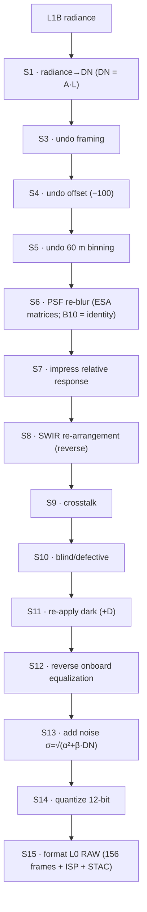
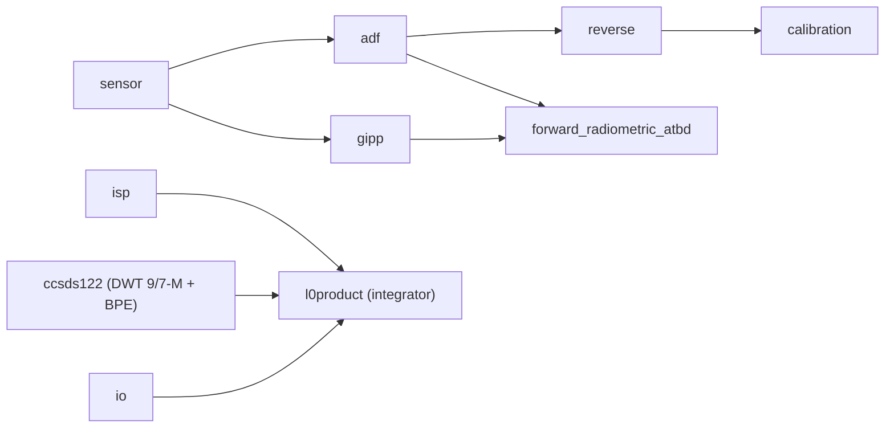

<!--
  Copyright 2026 Can Deniz Kaya

  Licensed under the Apache License, Version 2.0 (the "License");
  you may not use this file except in compliance with the License.
  You may obtain a copy of the License at

    http://www.apache.org/licenses/LICENSE-2.0

  Unless required by applicable law or agreed to in writing, software
  distributed under the License is distributed on an "AS IS" BASIS,
  WITHOUT WARRANTIES OR CONDITIONS OF ANY KIND, either express or implied.
  See the License for the specific language governing permissions and
  limitations under the License.
-->

# Software design overview

## Software static architecture

### Component view
The software is the single Python package `s2_msi_raw_generator` (one CSC). Modules:

| Module | Responsibility |
|---|---|
| `sensor.py` | Sentinel-2 sensor model — harvested constants: bands, GSD, physical gains, Lref/SNR, integration time, TDI/SWIR sets, per-unit SRF (centre/bandwidth/equivalent wavelength), noise model α/β, dark pedestal, EQ-gain stability, quantization. `Band` dataclass (`.dn_ref`, `.cal_gain`, `.dark_dsnu`). |
| `gipp.py` | Original parser of the  operational S2A GIPP XML → per-pixel arrays: R2EQOG (dark `COEFF_D` + cubic/bilinear relative-response gains), R2DEPI (defective), BLINDP (blind), R2PARA (offsets/flags), R2CRCO (crosstalk). |
| `adf.py` | Per-band ADF assembly:S2 PSF matrices (`data/psf/`), noise coefficients; builds `BandADF` `from_gipp` / `from_product` / `synthesize`. |
| `forward_radiometric_atbd.py` | Original implementation of the public L1 ATBD on-ground model $Z = X - D$, $Y = G(Z)$ and its **exact inverse** — the round-trip bridge. |
| `reverse.py` | The reverse radiometric chain — one pure-NumPy function per ATBD §5 step, plus the `reverse_mvp` / `reverse_full` chains and the exact-inverse `reverse_radiometric` / `forward_radiometric` bridge. |
| `calibration.py` | In-flight two-reference calibration sub-set: synthesize CSM sun-diffuser + dark, derive the dark/relative-response/absolute coefficients back (inverse-crime cure). |
| `isp.py` | S15 — CCSDS Instrument Source Packet + SAD telemetry generation. |
| `io.py` | Lightweight `zarr` reader for EOPF L1A/L1B products (no full EOPF dependency). |
| `l0product.py` | Assembly of the synthetic L0 RAW EOProduct Zarr (the ICD-IF-L0). |

### Data flow
Entry is at-sensor radiance (L1B) in per-detector geometry. The full ATBD §5 reverse chain:

The **implemented MVP execution order** (`reverse.reverse_mvp`) is `S1 → S6 → S7 → S13 → S11 → S12 →
S14`: noise (S13) is impressed on the **signal** DN *before* the S11 dark pedestal, so $\sigma = \sqrt{\alpha^2 + \beta \cdot \mathrm{DN}_\mathrm{signal}}$
reproduces the spec SNR@Lref exactly. `reverse_full` adds S8 (SWIR re-arrangement, reverse) and S10 (defects):
`S1 → S6 → S7 → [S8] → S13 → S11 → S12 → [S10] → S14`. The exact-inverse bridge `reverse_radiometric`
applies only `S1 → S7 → S11 → S12` (no PSF/noise/quantize) so it is algebraically invertible.

### Dependency graph
`sensor` is the foundational leaf (no intra-package imports). `adf` and `gipp` depend on `sensor`;
`forward_radiometric_atbd` depends on `gipp` (`DetectorEq`); `reverse` depends on `adf` (`BandADF`);
`calibration` depends on `adf` + `reverse`; `isp`, `io` and `ccsds122` (CCSDS 122.0-B lossless
image-compression codec, pure numpy) are leaves; `l0product` is the top integrator (imports
`sensor`, `adf`, `reverse`, `isp` — and `ccsds122` once the compressed-ISP payload schema of
ICD-IF-ISP is wired — plus the package version).

## Software dynamic architecture
The software is a synchronous library, not a long-running service: a caller reads an L1A/L1B frame
(`io`), builds a per-band ADF (`adf.from_gipp` / `synthesize`), runs the reverse chain (`reverse`) and
assembles the L0 product (`l0product`). The round-trip V&V and calibration sub-set are driven by the
`scripts/` entry points. There is no internal concurrency requirement; frames are independent and may be
processed in any order (embarrassingly parallel per detector/band).

## Software behaviour
Deterministic for a fixed RNG seed (REQ-QUAL-004). Errors are raised as explicit Python exceptions
(unknown band/unit → `KeyError`; wrong dtype into the L0 writer → `TypeError`). Saturated/no-data pixels
are flagged in the quality masks; the dark pedestal and per-pixel coefficients come from the GIPP
when supplied, else fall back to the published DQR/datasheet values.

## Interfaces context
Inputs: EOPF L1A/L1B Zarr products and the operational GIPP XML. Output: the L0 RAW EOProduct Zarr
(ICD-IF-L0). All interfaces are detailed in the ICD (`docs/icd.md`).

## Memory and CPU budget
Pure NumPy; memory is dominated by the per-detector/band frame arrays (a 10 m band detector image is
~9216 × 2592 float64 ≈ 190 MB transient). PSF kernels are cached. No GPU, no JVM, no external services.
Runtime dependencies: `numpy` (core) and `zarr` (product I/O) only.

## Design standards & conventions
ECSS-E-ST-40C Rev.1 (SDD DRD). Python ≥ 3.11, type-hinted, NumPy-docstring style. All algorithm steps are
implemented originally from the **public L1 ATBD** and the GIPP **data** format — no external processor
source is copied or referenced.
