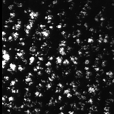
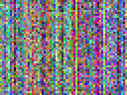
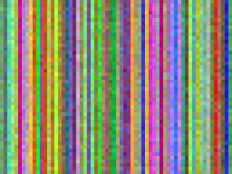

<!-- Copyright 2026 Can Deniz Kaya

Licensed under the Apache License, Version 2.0 (the "License");
you may not use this file except in compliance with the License.
You may obtain a copy of the License at

  http://www.apache.org/licenses/LICENSE-2.0

Unless required by applicable law or agreed to in writing, software
distributed under the License is distributed on an "AS IS" BASIS,
WITHOUT WARRANTIES OR CONDITIONS OF ANY KIND, either express or implied.
See the License for the specific language governing permissions and
limitations under the License. -->

# Showcase — real E2E products

## Real-data run (authoritative, SDE 2026-07-02)

The full **real-L1A** end-to-end (REQ-FUNC-093; details & numbers: [Real-L1A E2E
validation](vv/real_e2e.md)): the public-bucket L1A packaged as a **CCSDS-122-compressed,
real-space-packet L0** (overall lossless ratio **3.66×**, 30 642 packets), ground-decoded
bit-exactly, pushed through msi-processor `l0_decode` — **L1A′ bit-identical to the original
in 13/13 bands**, radiometric GIPP round-trip RMSE ≈ 1e-14.

| Real L1A scene (B04/B03/B02, raw per-detector geometry) | DWT LL3 subband (codec view) |
|---|---|
|  |  |

A dark ocean scene with cloud speckle; the band-to-band colour misregistration is *real* —
L1A is raw per-detector geometry (co-registration happens at L1B/L1C). Products are published
in the GitLab **Generic Package Registry** (`s2-msi-e2e-real/0.3.0`, PSFD `.zarr.zip` names).

## Synthetic demo chain

Products of the full **L0→L1B** end-to-end run: the generator's open-container L0 + cal-DB
consumed by `msi-processor` (`l0_decode → radiometric → enhancement → toa`, `eopf==2.8.1`),
ending in a persisted **L1B TOA-reflectance** EOPF product (`EOZarrStore` →
`l1b/L1B_TOA.zarr`). All chain products live under one **data store** root
(`l0/`, `caldb/`, `l1b/`, `quicklook/`).

| Synthetic L0 RAW (DN) | L1B TOA reflectance |
|---|---|
|  |  |

RGB = B04/B03/B02, per-channel 2–98 % percentile stretch (dependency-free
{py:mod}`s2_msi_raw_generator.quicklook`). The demo scene is a **flat field** (per-band uniform
radiance; band-mean reflectance ≈ 0.19 VNIR / 0.27 NIR / 0.05 SWIR), so the stretch deliberately
reveals texture rather than a landscape: the per-column striping is the impressed **PRNU**
pattern, the speckle is the shot/read-noise model.

## Reproduce

In an `eopf==2.8.1` + `msi_processor` environment (e.g. the SDE):

```console
$ python scripts/run_e2e_l0_to_l1b.py ~/data-store
```

or trigger the manual **`e2e-l1b`** CI job (builds the full environment from scratch, runs the
chain **and** the E2E pytest suite, and uploads the L1B product + these quicklooks as artifacts).
Without the processor installed, the driver still builds the L0 + cal-DB half and the L0
quicklook.
