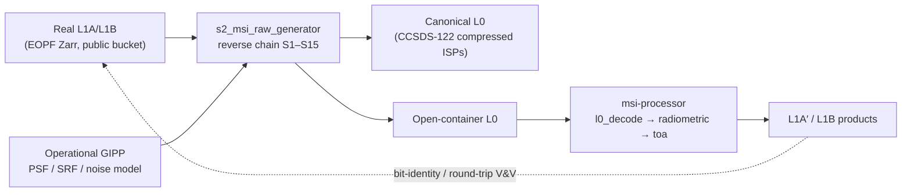

<!--
  Copyright 2026 Can Deniz Kaya

  Licensed under the Apache License, Version 2.0 (the "License");
  you may not use this file except in compliance with the License.
  You may obtain a copy of the License at

    http://www.apache.org/licenses/LICENSE-2.0

  Unless required by applicable law or agreed to in writing, software
  distributed under the License is distributed on an "AS IS" BASIS,
  WITHOUT WARRANTIES OR CONDITIONS OF ANY KIND, either express or implied.
  See the License for the specific language governing permissions and
  limitations under the License.
-->

# Software System Specification (SSS)

**Project:** Sentinel-2 MSI Synthetic Raw Data Generator (`s2_msi_raw_generator`) · **DRD:** ECSS-E-ST-40C Rev.1
Annex B (SSS). System-level requirements (SYS-NNN) are refined into the software requirements of the
[SRS](srs.md); interface requirements are detailed in the [IRD](ird.md) and controlled in the [ICD](icd.md).

## 1. Introduction

### 1.1 Purpose
Specify, at system level, the **reverse End-to-End performance Simulator (E2ES)** of the Sentinel-2 MSI:
a ground software system that degrades a real Sentinel-2 **L1A/L1B** product back to a synthetic
**L0 RAW** product carrying the true instrument effects, so that the forward `msi-processor` chain can be
exercised and validated end-to-end when true Sentinel-2 L0 data is unavailable.

### 1.2 Scope
One Computer Software Configuration Item (CSCI): the Python package `s2_msi_raw_generator` with its
driver scripts. Radiometric-only reverse chain (ATBD §5, steps S1–S15); geometry inversion is cancelled
(not applicable to an L1A/L1B entry). This SSS is deliberately compact for a single-CSC system — the
requirement mass lives in the [SRS](srs.md); tailoring is recorded in the [SDP](sdp.md).

### 1.3 Applicable & reference documents
| | |
|---|---|
| AD 1 | ECSS-E-ST-40C Rev.1 — Space engineering · Software |
| AD 2 | ECSS-Q-ST-80C — Software product assurance |
| RD 1 | [SRS](srs.md) — software requirements baseline (51 requirements) |
| RD 2 | [ATBD](atbd/atbd.md) — algorithm theoretical basis (issued v1.0) |
| RD 3 | [ICD](icd.md) / [IRD](ird.md) — interfaces |
| RD 4 | Sentinel-2 L1 ATBD (S2-PDGS-MPC-ATBD-L1) — forward radiometric model |

## 2. General description

### 2.1 System context
The system is the **forward-instrument conjugate** of the `msi-processor` (the EOPF Sentinel-2 MSI
processing prototype). Where the processor *inverts* instrument effects, this system *impresses* them:

External actors: the public Sentinel-2 sample-data S3 bucket (inputs), the EOPF Sample Data Environment
(SDE, execution host for the full-frame runs), the `msi-processor` CSCI (consumer of the open-container
L0 and the calibration-database ADFs), and the GitLab platform (CI, Pages, package registry).

### 2.2 General capabilities
1. **L0 RAW generation** — reconstruct a focal-plane L0 (12 detectors × 13 bands, 12-bit DN) from an
   L1A/L1B entry, impressing PSF blur, relative response/PRNU, dark signal, onboard equalization, noise,
   defects, SWIR arrangement and quantization from real S2B-sourced ADFs.
2. **Downlink-representative packaging** — carry the image data as CCSDS-122-lossless-compressed
   payloads in real CCSDS space packets (canonical L0), with a bit-exact ground decode; emit the
   open-container L0 the `msi-processor` ingests.
3. **Round-trip V&V** — prove `forward_correct ∘ reverse_impress` exactness on real L1A DN with the
   operational GIPP, and L1A′ ≡ L1A bit-identity through the full package → decode → `l0_decode` chain.
4. **Calibration sub-set** — derive dark/relative-response/absolute coefficients from synthetic CSM
   sun-diffuser + dark acquisitions (inverse-crime cure).

### 2.3 General constraints
- Runtime dependencies limited to `numpy` (+ `zarr` for I/O); no EOPF CPM required by the core
  (REQ-QUAL-001). The E2E drivers use the CPM only on the processor side.
- Originality: no external-processor source code; source-repository names do not appear in the
  deliverable (REQ-QUAL-003).
- All instrument data is real S2B-sourced (official PSF, SRF, product noise model, operational GIPP);
  nothing fitted or synthetic in the realized path.

### 2.4 Operational environment
Linux, Python ≥ 3.11. Development/CI on a public `python:3.12-slim` image (no credentials); authoritative
full-frame runs on the EOPF SDE. Products and reports are published through GitLab CI (Pages, generic
package registry).

### 2.5 Assumptions and dependencies
- The public bucket L1A is DN-scaled (not physically-calibrated radiance); absolute-radiometry checks use
  round-trip self-consistency with the GIPP (SRN §4).
- The real PSD L0 SAFE image-ISP `.bin` objects are GET-403 under the bucket policy; real image-packet
  accounting is therefore informative-only (see [Real-L1A E2E validation](vv/real_e2e.md), Known limits).

## 3. System requirements

System-level requirements; each is refined by the listed SRS requirements, where it is verified.

- **SYS-01 — Reverse E2ES function.** *The system shall generate a synthetic Sentinel-2 MSI L0 RAW
  product from a real L1A/L1B entry, impressing the instrument effects the forward processor removes.*
  → REQ-FUNC-010…022 (chain), REQ-FUNC-030…034 (product). **V: T**.
- **SYS-02 — Real-ADF fidelity.** *All radiometric instrument characteristics impressed by the system
  shall originate from real S2B-published data (PSF, SRF, noise model, operational GIPP).*
  → REQ-FUNC-015/046, REQ-FUNC-044 (fallback flagged as such). **V: T/I**.
- **SYS-03 — Processor interoperability.** *The system's L0 outputs shall be consumable by the
  `msi-processor` without modification of that processor.* → REQ-FUNC-042, REQ-IF-002. **V: T/I**.
- **SYS-04 — Downlink representativeness.** *The canonical L0 shall represent the real downlink shape:
  band data as losslessly compressed payloads in CCSDS space packets, ground-decodable bit-exactly.*
  → REQ-FUNC-092. **V: T**.
- **SYS-05 — End-to-end verifiability.** *The system shall demonstrate, on real data, that its packaging
  and the processor's decode are exactly transparent to the science data (L1A′ ≡ L1A on kept lines) and
  that its radiometric model is exactly invertible (round-trip RMSE → 0).* → REQ-FUNC-093, REQ-PERF-003.
  **V: T/I** (authoritative SDE run, 2026-07-02: 13/13 bit-identical, RMSE ≈ 1e-14).
- **SYS-06 — Product identification.** *Every emitted product shall carry a unique, parseable
  identification per the EOPF PSFD §3 coding system (ECSS-M-ST-40C identification requirement).*
  → REQ-FUNC-091. **V: T**.
- **SYS-07 — Autonomy of the core.** *The core system shall run with minimal dependencies and no
  credentials, so it is executable in any public CI environment.* → REQ-QUAL-001, REQ-QUAL-004. **V: I/T**.

## 4. Verification
System-level verification is subsumed by the software V&V programme: the [V&V plan](vv/plan.md)
(methods T/A/I/R), the [SUITP](vv/suitp.md) (unit/integration test plan), and the results in the
[V&V report](vv/report.md), [SUITR](vv/suitr.md) and [Real-L1A E2E validation](vv/real_e2e.md).
The qualification status is assessed in the [QR report](qr.md).
