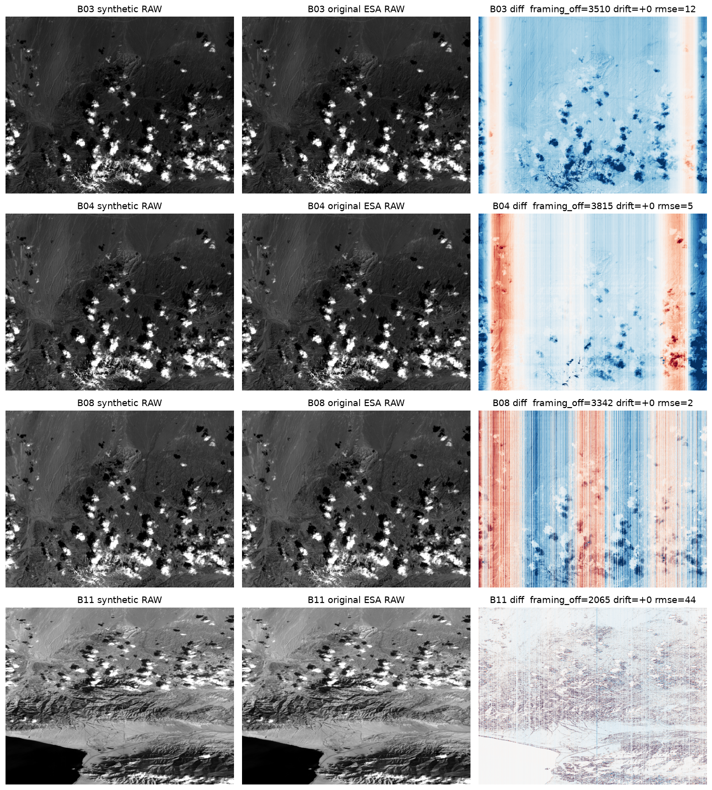

# Real-L1A E2E run report

- L1A: `/home/jovyan/validation-data/e2e-real/inputs/PDI_MSI_S2_L1A.zarr` · bands 13 · lines 21384 · bit_depth 16
- Products: `S02MSIL0__20240403T102415_0033_A045_TC42.zarr` / `S02MSIL0__20240403T102415_0033_A045_TC42_OC.zarr` / `S02MSIL1A_20240403T102415_0033_A045_T6DE.zarr`
- Naming fallbacks: ['datetime', 'sat:relative_orbit', 'platform']

## Reverse L1B → L1A → L0plus → L0 (full ladder) — 2024-04-08 S2B PPB

The exact inverse of the *full* operational L0→L1B radiometric chain
(`forward_radiometric_atbd.reverse_l1b_to_l0`), materialised as the full EOPF product ladder
(`reverse-l1b` → **L1A** raw counts; `package-l0` → **L0plus** CCSDS ISP + ancillary → **L0** decoded
`img`), validated against the **real S2B L0/L1B pair** for the 2024-04-08 PPB datatake (detector d05, all
13 bands). The synthetic **L1A** is compared to the **real ESA L0 `img`** directly — the archived EOPF L0
stores decompressed `img` (verified on the TC7D granule), so no decoding is needed on the reference side;
our own codec is only round-tripped on the synthetic L0plus (asserted bit-exact). Alignment uses the exact
ADF_PRDLO `begin_nb_lines_to_cut` per band/detector (from the L1B metadata) + a small cross-correlation
refinement for the ~28-line legacy datation drift.

**Synthetic L1A vs original ESA L0 `img` — RMSE (DN), framing offset, line drift (drift 0 throughout):**

| band | B01 | B02 | B03 | B04 | B05 | B06 | B07 | B08 | B8A | B09 | B10 | B11 | B12 |
|---|---|---|---|---|---|---|---|---|---|---|---|---|---|
| framing offset | 776 | 3176 | 3510 | 3815 | 1992 | 2075 | 2158 | 3342 | 2241 | 803 | 622 | 2065 | 2264 |
| RMSE (DN) | *149.6* | 0.8 | 1.5 | 1.8 | 1.1 | 1.0 | 0.9 | 0.8 | 1.1 | *96.9* | *22.0* | **4.2** | **3.9** |
| resolution | 60 m | 10 m | 10 m | 10 m | 20 m | 20 m | 20 m | 10 m | 20 m | 60 m | 60 m | 20 m | 20 m |

All **ten 10 m + 20 m bands agree to ≤ ~4 DN** with zero residual line-drift (the per-band framing offset is
exact). The three *native-60 m* bands (**B01/B09/B10**, italic) carry higher RMSE because the reverse
un-bin is a ×3 line replication — the sub-pixel detail the forward 60 m binning averaged away is
**irrecoverable** (their median offsets stay small: 0.7–5.9 %). Regenerate with
`scripts/reverse_compare_figure.py`.

**S8 SWIR re-arrangement** is the decisive step for the SWIR bands: re-introducing the staggered
detector readout (ADF_RSWIR per-column ±1-line shift map) drops the B11/B12 residual from ~50 DN of
stripe texture to ~3 DN. Plain (no S8, diff rmse ~40) vs full chain (diff rmse ~5):

The L0 is ~5067 lines longer than L1B — the forward **Framing** (coarse-registration) step crops
`begin/end_nb_lines_to_cut` per (band, detector) to co-register all detectors to a common along-track
extent. Using those exact ADF_PRDLO offsets aligns the comparison with no hand-tuning (drift 0):

Steps applied, in reverse order: offset (R2PARA) → relative response (R2EQOG) → on-board eq (REOB2) →
dark → un-bin → **SWIR re-arrangement (RSWIR)** → defective (R2DEPI); crosstalk (RCRCO) added back
phase-level (≈0 for S2A/B). **MTF restoration/deconvolution is off in the forward chain** (L1B keeps
the instrument PSF), so PSF re-blur (S6) and noise (S13) are **not** re-applied — see
[DPM parameters-data-list](../dpm/parameters-data-list.md). Reproduce:
`S2_E2ES_PHASES=reverse-l1b S2_E2ES_L1B=<L1B.zarr> python scripts/run_pipeline.py`; visual notebook
`notebooks/reverse_l1b_compare.ipynb`.

## Compression + ground decode (bit-exact)

| band | ratio | packets | bit-exact |
|---|---|---|---|
| B01 | 3.3928 | 455 | True |
| B02 | 3.4384 | 5305 | True |
| B03 | 3.5504 | 5305 | True |
| B04 | 3.7229 | 5305 | True |
| B05 | 3.5679 | 1343 | True |
| B06 | 3.7023 | 1343 | True |
| B07 | 3.8643 | 1343 | True |
| B08 | 3.8885 | 5305 | True |
| B09 | 4.671 | 452 | True |
| B10 | 4.6589 | 452 | True |
| B11 | 3.4702 | 1343 | True |
| B12 | 3.365 | 1348 | True |
| B8A | 3.8949 | 1343 | True |

## L1A′ vs original L1A

| band | bit-identical (kept) | lines lost | rmse |
|---|---|---|---|
| B01 | True | 0 | 0.0 |
| B02 | True | 0 | 0.0 |
| B03 | True | 0 | 0.0 |
| B04 | True | 0 | 0.0 |
| B05 | True | 0 | 0.0 |
| B06 | True | 0 | 0.0 |
| B07 | True | 0 | 0.0 |
| B08 | True | 0 | 0.0 |
| B09 | True | 0 | 0.0 |
| B10 | True | 0 | 0.0 |
| B11 | True | 0 | 0.0 |
| B12 | True | 0 | 0.0 |
| B8A | True | 0 | 0.0 |

## Radiometric GIPP round-trip

| band | rmse | fpn raw → corrected |
|---|---|---|
| B01 | 2.769e-16 | 0.102 → 0.199 |
| B02 | 3.742e-15 | 0.060 → 0.331 |
| B03 | 6.439e-15 | 0.048 → 0.297 |
| B04 | 9.279e-15 | 0.037 → 0.301 |
| B05 | 1.051e-14 | 0.050 → 0.320 |
| B06 | 1.090e-14 | 0.043 → 0.279 |
| B07 | 1.215e-14 | 0.038 → 0.210 |
| B08 | 1.096e-14 | 0.026 → 0.246 |
| B09 | 1.507e-14 | 0.016 → 0.000 |
| B10 | 8.953e-15 | 0.014 → 0.000 |
| B11 | 6.566e-15 | 0.045 → 0.345 |
| B12 | 5.153e-15 | 0.174 → 0.354 |
| B8A | 9.684e-15 | 0.035 → 0.187 |

## Real-L0 ISP structural scan

- PSD L0 SAFE image-ISP .bin objects are HTTP 403 on GET (bucket policy) — image-packet accounting not possible; structural ISP validation done on real SADATA packet streams
- Real SADATA members tiling exactly: 2/68

| member | packets | tiles | seq continuous | data-len min..max |
|---|---|---|---|---|
| S2A_OPER_AUX_SADATA_2APS_20241218T042947_V20241218T034819_20241218T041652_A049565_WP_LN.tar::S2A_OPER_AUX_SADATA_2APS_20241218T042947_V20241218T034819_20241218T041652_A049565_WP_LN/S2A_OPER_AUX_S48225_2APS_20241218T042950_V20241218T034819_20241218T041652_A049565_WP_LN | 1 | False | True | 236..236 |
| S2A_OPER_AUX_SADATA_2APS_20241218T042947_V20241218T034819_20241218T041652_A049565_WP_LN.tar::S2A_OPER_AUX_SADATA_2APS_20241218T042947_V20241218T034819_20241218T041652_A049565_WP_LN/S2A_OPER_AUX_S11121_2APS_20241218T042949_V20241218T034819_20241218T041652_A049565_WP_LN | 38 | False | False | 2..64576 |
| S2A_OPER_AUX_SADATA_2APS_20241218T042947_V20241218T034819_20241218T041652_A049565_WP_LN.tar::S2A_OPER_AUX_SADATA_2APS_20241218T042947_V20241218T034819_20241218T041652_A049565_WP_LN/S2A_OPER_AUX_S11113_2APS_20241218T042948_V20241218T034819_20241218T041652_A049565_WP_LN | 10 | False | True | 236..63385 |
| S2A_OPER_AUX_SADATA_2APS_20241218T042947_V20241218T034819_20241218T041652_A049565_WP_LN.tar::S2A_OPER_AUX_SADATA_2APS_20241218T042947_V20241218T034819_20241218T041652_A049565_WP_LN/S2A_OPER_AUX_S11127_2APS_20241218T042950_V20241218T034819_20241218T041652_A049565_WP_LN | 1 | False | True | 236..236 |
| S2A_OPER_AUX_SADATA_2APS_20241218T042947_V20241218T034819_20241218T041652_A049565_WP_LN.tar::S2A_OPER_AUX_SADATA_2APS_20241218T042947_V20241218T034819_20241218T041652_A049565_WP_LN/S2A_OPER_AUX_S09123_2APS_20241218T042947_V20241218T034819_20241218T041652_A049565_WP_LN | 3 | False | False | 1..6709 |
| S2A_OPER_AUX_SADATA_2APS_20241218T042947_V20241218T034819_20241218T041652_A049565_WP_LN.tar::S2A_OPER_AUX_SADATA_2APS_20241218T042947_V20241218T034819_20241218T041652_A049565_WP_LN/S2A_OPER_AUX_S37105_2APS_20241218T042950_V20241218T034819_20241218T041652_A049565_WP_LN | 97 | False | False | 1..64346 |
| S2A_OPER_AUX_SADATA_2APS_20241218T042947_V20241218T034819_20241218T041652_A049565_WP_LN.tar::S2A_OPER_AUX_SADATA_2APS_20241218T042947_V20241218T034819_20241218T041652_A049565_WP_LN/S2A_OPER_AUX_S11117_2APS_20241218T042949_V20241218T034819_20241218T041652_A049565_WP_LN | 8 | False | True | 236..64423 |
| S2A_OPER_AUX_SADATA_2APS_20241218T042947_V20241218T034819_20241218T041652_A049565_WP_LN.tar::S2A_OPER_AUX_SADATA_2APS_20241218T042947_V20241218T034819_20241218T041652_A049565_WP_LN/S2A_OPER_AUX_S48226_2APS_20241218T042950_V20241218T034819_20241218T041652_A049565_WP_LN | 5 | False | False | 10..22300 |
| S2A_OPER_AUX_SADATA_2APS_20241218T042947_V20241218T034819_20241218T041652_A049565_WP_LN.tar::S2A_OPER_AUX_SADATA_2APS_20241218T042947_V20241218T034819_20241218T041652_A049565_WP_LN/Inventory_Metadata.xml | 0 | False | True | None..None |
| S2A_OPER_AUX_SADATA_2APS_20241218T042947_V20241218T034819_20241218T041652_A049565_WP_LN.tar::S2A_OPER_AUX_SADATA_2APS_20241218T042947_V20241218T034819_20241218T041652_A049565_WP_LN/S2A_OPER_AUX_S11114_2APS_20241218T042948_V20241218T034819_20241218T041652_A049565_WP_LN | 12 | False | True | 236..54505 |
| S2A_OPER_AUX_SADATA_2APS_20241218T042947_V20241218T034819_20241218T041652_A049565_WP_LN.tar::S2A_OPER_AUX_SADATA_2APS_20241218T042947_V20241218T034819_20241218T041652_A049565_WP_LN/S2A_OPER_AUX_S11109_2APS_20241218T042948_V20241218T034819_20241218T041652_A049565_WP_LN | 7 | False | False | 1..54785 |
| S2A_OPER_AUX_SADATA_2APS_20241218T042947_V20241218T034819_20241218T041652_A049565_WP_LN.tar::S2A_OPER_AUX_SADATA_2APS_20241218T042947_V20241218T034819_20241218T041652_A049565_WP_LN/S2A_OPER_AUX_S48223_2APS_20241218T042950_V20241218T034819_20241218T041652_A049565_WP_LN | 9 | False | True | 1..59354 |
| S2A_OPER_AUX_SADATA_2APS_20241218T042947_V20241218T034819_20241218T041652_A049565_WP_LN.tar::S2A_OPER_AUX_SADATA_2APS_20241218T042947_V20241218T034819_20241218T041652_A049565_WP_LN/S2A_OPER_AUX_S38105_2APS_20241218T042950_V20241218T034819_20241218T041652_A049565_WP_LN | 267 | False | False | 236..65125 |
| S2A_OPER_AUX_SADATA_2APS_20241218T042947_V20241218T034819_20241218T041652_A049565_WP_LN.tar::S2A_OPER_AUX_SADATA_2APS_20241218T042947_V20241218T034819_20241218T041652_A049565_WP_LN/S2A_OPER_AUX_S11115_2APS_20241218T042948_V20241218T034819_20241218T041652_A049565_WP_LN | 12 | False | True | 36..61635 |
| S2A_OPER_AUX_SADATA_2APS_20241218T042947_V20241218T034819_20241218T041652_A049565_WP_LN.tar::S2A_OPER_AUX_SADATA_2APS_20241218T042947_V20241218T034819_20241218T041652_A049565_WP_LN/S2A_OPER_AUX_S11122_2APS_20241218T042949_V20241218T034819_20241218T041652_A049565_WP_LN | 10 | False | False | 101..43037 |
| S2A_OPER_AUX_SADATA_2APS_20241218T042947_V20241218T034819_20241218T041652_A049565_WP_LN.tar::S2A_OPER_AUX_SADATA_2APS_20241218T042947_V20241218T034819_20241218T041652_A049565_WP_LN/S2A_OPER_AUX_S48230_2APS_20241218T042951_V20241218T034819_20241218T041652_A049565_WP_LN | 0 | True | True | None..None |
| S2A_OPER_AUX_SADATA_2APS_20241218T042947_V20241218T034819_20241218T041652_A049565_WP_LN.tar::S2A_OPER_AUX_SADATA_2APS_20241218T042947_V20241218T034819_20241218T041652_A049565_WP_LN/S2A_OPER_AUX_S48229_2APS_20241218T042951_V20241218T034819_20241218T041652_A049565_WP_LN | 0 | False | True | None..None |
| S2A_OPER_AUX_SADATA_2APS_20241218T042947_V20241218T034819_20241218T041652_A049565_WP_LN.tar::S2A_OPER_AUX_SADATA_2APS_20241218T042947_V20241218T034819_20241218T041652_A049565_WP_LN/S2A_OPER_AUX_S11125_2APS_20241218T042949_V20241218T034819_20241218T041652_A049565_WP_LN | 14 | False | False | 1..61525 |
| S2A_OPER_AUX_SADATA_2APS_20241218T042947_V20241218T034819_20241218T041652_A049565_WP_LN.tar::S2A_OPER_AUX_SADATA_2APS_20241218T042947_V20241218T034819_20241218T041652_A049565_WP_LN/S2A_OPER_AUX_S11106_2APS_20241218T042948_V20241218T034819_20241218T041652_A049565_WP_LN | 8 | False | False | 1..46801 |
| S2A_OPER_AUX_SADATA_2APS_20241218T042947_V20241218T034819_20241218T041652_A049565_WP_LN.tar::S2A_OPER_AUX_SADATA_2APS_20241218T042947_V20241218T034819_20241218T041652_A049565_WP_LN/S2A_OPER_AUX_S11126_2APS_20241218T042949_V20241218T034819_20241218T041652_A049565_WP_LN | 11 | False | False | 1..58881 |
| S2A_OPER_AUX_SADATA_2APS_20241218T042947_V20241218T034819_20241218T041652_A049565_WP_LN.tar::S2A_OPER_AUX_SADATA_2APS_20241218T042947_V20241218T034819_20241218T041652_A049565_WP_LN/S2A_OPER_AUX_S11119_2APS_20241218T042949_V20241218T034819_20241218T041652_A049565_WP_LN | 8 | False | False | 236..52737 |
| S2A_OPER_AUX_SADATA_2APS_20241218T042947_V20241218T034819_20241218T041652_A049565_WP_LN.tar::S2A_OPER_AUX_SADATA_2APS_20241218T042947_V20241218T034819_20241218T041652_A049565_WP_LN/S2A_OPER_AUX_S11108_2APS_20241218T042948_V20241218T034819_20241218T041652_A049565_WP_LN | 38 | False | False | 1..55192 |
| S2A_OPER_AUX_SADATA_2APS_20241218T042947_V20241218T034819_20241218T041652_A049565_WP_LN.tar::S2A_OPER_AUX_SADATA_2APS_20241218T042947_V20241218T034819_20241218T041652_A049565_WP_LN/S2A_OPER_AUX_S11124_2APS_20241218T042949_V20241218T034819_20241218T041652_A049565_WP_LN | 22 | False | False | 1..40449 |
| S2A_OPER_AUX_SADATA_2APS_20241218T042947_V20241218T034819_20241218T041652_A049565_WP_LN.tar::S2A_OPER_AUX_SADATA_2APS_20241218T042947_V20241218T034819_20241218T041652_A049565_WP_LN/S2A_OPER_AUX_S11116_2APS_20241218T042948_V20241218T034819_20241218T041652_A049565_WP_LN | 12 | False | True | 1..54529 |
| S2A_OPER_AUX_SADATA_2APS_20241218T042947_V20241218T034819_20241218T041652_A049565_WP_LN.tar::S2A_OPER_AUX_SADATA_2APS_20241218T042947_V20241218T034819_20241218T041652_A049565_WP_LN/S2A_OPER_AUX_S11110_2APS_20241218T042948_V20241218T034819_20241218T041652_A049565_WP_LN | 9 | False | True | 236..63233 |
| S2A_OPER_AUX_SADATA_2APS_20241218T042947_V20241218T034819_20241218T041652_A049565_WP_LN.tar::S2A_OPER_AUX_SADATA_2APS_20241218T042947_V20241218T034819_20241218T041652_A049565_WP_LN/S2A_OPER_AUX_S11105_2APS_20241218T042947_V20241218T034819_20241218T041652_A049565_WP_LN | 11 | False | True | 236..65535 |
| S2A_OPER_AUX_SADATA_2APS_20241218T042947_V20241218T034819_20241218T041652_A049565_WP_LN.tar::S2A_OPER_AUX_SADATA_2APS_20241218T042947_V20241218T034819_20241218T041652_A049565_WP_LN/S2A_OPER_AUX_S48224_2APS_20241218T042954_V20241218T034819_20241218T041652_A049565_WP_LN | 2 | False | True | 236..25139 |
| S2A_OPER_AUX_SADATA_2APS_20241218T042947_V20241218T034819_20241218T041652_A049565_WP_LN.tar::S2A_OPER_AUX_SADATA_2APS_20241218T042947_V20241218T034819_20241218T041652_A049565_WP_LN/S2A_OPER_AUX_S11118_2APS_20241218T042949_V20241218T034819_20241218T041652_A049565_WP_LN | 11 | False | True | 2..54081 |
| S2A_OPER_AUX_SADATA_2APS_20241218T042947_V20241218T034819_20241218T041652_A049565_WP_LN.tar::S2A_OPER_AUX_SADATA_2APS_20241218T042947_V20241218T034819_20241218T041652_A049565_WP_LN/S2A_OPER_AUX_S48232_2APS_20241218T042951_V20241218T034819_20241218T041652_A049565_WP_LN | 0 | True | True | None..None |
| S2A_OPER_AUX_SADATA_2APS_20241218T042947_V20241218T034819_20241218T041652_A049565_WP_LN.tar::S2A_OPER_AUX_SADATA_2APS_20241218T042947_V20241218T034819_20241218T041652_A049565_WP_LN/S2A_OPER_AUX_S11111_2APS_20241218T042948_V20241218T034819_20241218T041652_A049565_WP_LN | 14 | False | False | 6..44653 |
| S2A_OPER_AUX_SADATA_2APS_20241218T042947_V20241218T034819_20241218T041652_A049565_WP_LN.tar::S2A_OPER_AUX_SADATA_2APS_20241218T042947_V20241218T034819_20241218T041652_A049565_WP_LN/S2A_OPER_AUX_S11120_2APS_20241218T042949_V20241218T034819_20241218T041652_A049565_WP_LN | 10 | False | True | 236..65288 |
| S2A_OPER_AUX_SADATA_2APS_20241218T042947_V20241218T034819_20241218T041652_A049565_WP_LN.tar::S2A_OPER_AUX_SADATA_2APS_20241218T042947_V20241218T034819_20241218T041652_A049565_WP_LN/S2A_OPER_AUX_S48227_2APS_20241218T042950_V20241218T034819_20241218T041652_A049565_WP_LN | 3 | False | True | 236..37954 |
| S2A_OPER_AUX_SADATA_2APS_20241218T042947_V20241218T034819_20241218T041652_A049565_WP_LN.tar::S2A_OPER_AUX_SADATA_2APS_20241218T042947_V20241218T034819_20241218T041652_A049565_WP_LN/S2A_OPER_AUX_S48218_2APS_20241218T042950_V20241218T034819_20241218T041652_A049565_WP_LN | 9 | False | False | 54..61187 |
| S2A_OPER_AUX_SADATA_2APS_20241218T042947_V20241218T034819_20241218T041652_A049565_WP_LN.tar::S2A_OPER_AUX_SADATA_2APS_20241218T042947_V20241218T034819_20241218T041652_A049565_WP_LN/S2A_OPER_AUX_S48231_2APS_20241218T042951_V20241218T034819_20241218T041652_A049565_WP_LN | 1 | False | True | 236..236 |
| S2A_OPER_AUX_SADATA_2APS_20241218T042947_V20241218T034819_20241218T041652_A049565_WP_LN.tar::S2A_OPER_AUX_SADATA_2APS_20241218T042947_V20241218T034819_20241218T041652_A049565_WP_LN/S2A_OPER_AUX_S11112_2APS_20241218T042948_V20241218T034819_20241218T041652_A049565_WP_LN | 7 | False | False | 236..64849 |
| S2A_OPER_AUX_SADATA_2APS_20241218T074251_V20241218T070943_20241218T072345_A049567_WP_LN.tar::S2A_OPER_AUX_SADATA_2APS_20241218T074251_V20241218T070943_20241218T072345_A049567_WP_LN/S2A_OPER_AUX_S11106_2APS_20241218T074251_V20241218T070943_20241218T072345_A049567_WP_LN | 2 | False | False | 407..60600 |
| S2A_OPER_AUX_SADATA_2APS_20241218T074251_V20241218T070943_20241218T072345_A049567_WP_LN.tar::S2A_OPER_AUX_SADATA_2APS_20241218T074251_V20241218T070943_20241218T072345_A049567_WP_LN/S2A_OPER_AUX_S11124_2APS_20241218T074253_V20241218T070943_20241218T072345_A049567_WP_LN | 2 | False | True | 407..52613 |
| S2A_OPER_AUX_SADATA_2APS_20241218T074251_V20241218T070943_20241218T072345_A049567_WP_LN.tar::S2A_OPER_AUX_SADATA_2APS_20241218T074251_V20241218T070943_20241218T072345_A049567_WP_LN/S2A_OPER_AUX_S11126_2APS_20241218T074253_V20241218T070943_20241218T072345_A049567_WP_LN | 7 | False | False | 1..52614 |
| S2A_OPER_AUX_SADATA_2APS_20241218T074251_V20241218T070943_20241218T072345_A049567_WP_LN.tar::S2A_OPER_AUX_SADATA_2APS_20241218T074251_V20241218T070943_20241218T072345_A049567_WP_LN/S2A_OPER_AUX_S09123_2APS_20241218T074251_V20241218T070943_20241218T072345_A049567_WP_LN | 2 | False | True | 257..407 |
| S2A_OPER_AUX_SADATA_2APS_20241218T074251_V20241218T070943_20241218T072345_A049567_WP_LN.tar::S2A_OPER_AUX_SADATA_2APS_20241218T074251_V20241218T070943_20241218T072345_A049567_WP_LN/S2A_OPER_AUX_S11113_2APS_20241218T074252_V20241218T070943_20241218T072345_A049567_WP_LN | 5 | False | True | 407..63869 |
| S2A_OPER_AUX_SADATA_2APS_20241218T074251_V20241218T070943_20241218T072345_A049567_WP_LN.tar::S2A_OPER_AUX_SADATA_2APS_20241218T074251_V20241218T070943_20241218T072345_A049567_WP_LN/Inventory_Metadata.xml | 0 | False | True | None..None |
| S2A_OPER_AUX_SADATA_2APS_20241218T074251_V20241218T070943_20241218T072345_A049567_WP_LN.tar::S2A_OPER_AUX_SADATA_2APS_20241218T074251_V20241218T070943_20241218T072345_A049567_WP_LN/S2A_OPER_AUX_S48223_2APS_20241218T074254_V20241218T070943_20241218T072345_A049567_WP_LN | 2 | False | True | 407..53030 |
| S2A_OPER_AUX_SADATA_2APS_20241218T074251_V20241218T070943_20241218T072345_A049567_WP_LN.tar::S2A_OPER_AUX_SADATA_2APS_20241218T074251_V20241218T070943_20241218T072345_A049567_WP_LN/S2A_OPER_AUX_S48229_2APS_20241218T074254_V20241218T070943_20241218T072345_A049567_WP_LN | 0 | False | True | None..None |
| S2A_OPER_AUX_SADATA_2APS_20241218T074251_V20241218T070943_20241218T072345_A049567_WP_LN.tar::S2A_OPER_AUX_SADATA_2APS_20241218T074251_V20241218T070943_20241218T072345_A049567_WP_LN/S2A_OPER_AUX_S48224_2APS_20241218T074257_V20241218T070943_20241218T072345_A049567_WP_LN | 3 | False | True | 407..4183 |
| S2A_OPER_AUX_SADATA_2APS_20241218T074251_V20241218T070943_20241218T072345_A049567_WP_LN.tar::S2A_OPER_AUX_SADATA_2APS_20241218T074251_V20241218T070943_20241218T072345_A049567_WP_LN/S2A_OPER_AUX_S11119_2APS_20241218T074252_V20241218T070943_20241218T072345_A049567_WP_LN | 7 | False | True | 341..48078 |
| S2A_OPER_AUX_SADATA_2APS_20241218T074251_V20241218T070943_20241218T072345_A049567_WP_LN.tar::S2A_OPER_AUX_SADATA_2APS_20241218T074251_V20241218T070943_20241218T072345_A049567_WP_LN/S2A_OPER_AUX_S11120_2APS_20241218T074252_V20241218T070943_20241218T072345_A049567_WP_LN | 5 | False | True | 407..62483 |
| S2A_OPER_AUX_SADATA_2APS_20241218T074251_V20241218T070943_20241218T072345_A049567_WP_LN.tar::S2A_OPER_AUX_SADATA_2APS_20241218T074251_V20241218T070943_20241218T072345_A049567_WP_LN/S2A_OPER_AUX_S11115_2APS_20241218T074252_V20241218T070943_20241218T072345_A049567_WP_LN | 7 | False | True | 1..46790 |
| S2A_OPER_AUX_SADATA_2APS_20241218T074251_V20241218T070943_20241218T072345_A049567_WP_LN.tar::S2A_OPER_AUX_SADATA_2APS_20241218T074251_V20241218T070943_20241218T072345_A049567_WP_LN/S2A_OPER_AUX_S11127_2APS_20241218T074253_V20241218T070943_20241218T072345_A049567_WP_LN | 3 | False | True | 1..407 |
| S2A_OPER_AUX_SADATA_2APS_20241218T074251_V20241218T070943_20241218T072345_A049567_WP_LN.tar::S2A_OPER_AUX_SADATA_2APS_20241218T074251_V20241218T070943_20241218T072345_A049567_WP_LN/S2A_OPER_AUX_S48227_2APS_20241218T074254_V20241218T070943_20241218T072345_A049567_WP_LN | 1 | False | True | 407..407 |
| S2A_OPER_AUX_SADATA_2APS_20241218T074251_V20241218T070943_20241218T072345_A049567_WP_LN.tar::S2A_OPER_AUX_SADATA_2APS_20241218T074251_V20241218T070943_20241218T072345_A049567_WP_LN/S2A_OPER_AUX_S48225_2APS_20241218T074254_V20241218T070943_20241218T072345_A049567_WP_LN | 3 | False | True | 407..768 |
| S2A_OPER_AUX_SADATA_2APS_20241218T074251_V20241218T070943_20241218T072345_A049567_WP_LN.tar::S2A_OPER_AUX_SADATA_2APS_20241218T074251_V20241218T070943_20241218T072345_A049567_WP_LN/S2A_OPER_AUX_S48231_2APS_20241218T074254_V20241218T070943_20241218T072345_A049567_WP_LN | 0 | False | True | None..None |
| S2A_OPER_AUX_SADATA_2APS_20241218T074251_V20241218T070943_20241218T072345_A049567_WP_LN.tar::S2A_OPER_AUX_SADATA_2APS_20241218T074251_V20241218T070943_20241218T072345_A049567_WP_LN/S2A_OPER_AUX_S11116_2APS_20241218T074252_V20241218T070943_20241218T072345_A049567_WP_LN | 4 | False | True | 407..62528 |
| S2A_OPER_AUX_SADATA_2APS_20241218T074251_V20241218T070943_20241218T072345_A049567_WP_LN.tar::S2A_OPER_AUX_SADATA_2APS_20241218T074251_V20241218T070943_20241218T072345_A049567_WP_LN/S2A_OPER_AUX_S11111_2APS_20241218T074252_V20241218T070943_20241218T072345_A049567_WP_LN | 11 | False | False | 1..50032 |
| S2A_OPER_AUX_SADATA_2APS_20241218T074251_V20241218T070943_20241218T072345_A049567_WP_LN.tar::S2A_OPER_AUX_SADATA_2APS_20241218T074251_V20241218T070943_20241218T072345_A049567_WP_LN/S2A_OPER_AUX_S11110_2APS_20241218T074252_V20241218T070943_20241218T072345_A049567_WP_LN | 4 | False | True | 1..39962 |
| S2A_OPER_AUX_SADATA_2APS_20241218T074251_V20241218T070943_20241218T072345_A049567_WP_LN.tar::S2A_OPER_AUX_SADATA_2APS_20241218T074251_V20241218T070943_20241218T072345_A049567_WP_LN/S2A_OPER_AUX_S11117_2APS_20241218T074252_V20241218T070943_20241218T072345_A049567_WP_LN | 4 | False | True | 407..61746 |
| S2A_OPER_AUX_SADATA_2APS_20241218T074251_V20241218T070943_20241218T072345_A049567_WP_LN.tar::S2A_OPER_AUX_SADATA_2APS_20241218T074251_V20241218T070943_20241218T072345_A049567_WP_LN/S2A_OPER_AUX_S48218_2APS_20241218T074254_V20241218T070943_20241218T072345_A049567_WP_LN | 5 | False | True | 149..33409 |
| S2A_OPER_AUX_SADATA_2APS_20241218T074251_V20241218T070943_20241218T072345_A049567_WP_LN.tar::S2A_OPER_AUX_SADATA_2APS_20241218T074251_V20241218T070943_20241218T072345_A049567_WP_LN/S2A_OPER_AUX_S11121_2APS_20241218T074253_V20241218T070943_20241218T072345_A049567_WP_LN | 21 | False | True | 54..59607 |
| S2A_OPER_AUX_SADATA_2APS_20241218T074251_V20241218T070943_20241218T072345_A049567_WP_LN.tar::S2A_OPER_AUX_SADATA_2APS_20241218T074251_V20241218T070943_20241218T072345_A049567_WP_LN/S2A_OPER_AUX_S11105_2APS_20241218T074251_V20241218T070943_20241218T072345_A049567_WP_LN | 5 | False | True | 24..65536 |
| S2A_OPER_AUX_SADATA_2APS_20241218T074251_V20241218T070943_20241218T072345_A049567_WP_LN.tar::S2A_OPER_AUX_SADATA_2APS_20241218T074251_V20241218T070943_20241218T072345_A049567_WP_LN/S2A_OPER_AUX_S48226_2APS_20241218T074254_V20241218T070943_20241218T072345_A049567_WP_LN | 3 | False | True | 407..6341 |
| S2A_OPER_AUX_SADATA_2APS_20241218T074251_V20241218T070943_20241218T072345_A049567_WP_LN.tar::S2A_OPER_AUX_SADATA_2APS_20241218T074251_V20241218T070943_20241218T072345_A049567_WP_LN/S2A_OPER_AUX_S11112_2APS_20241218T074252_V20241218T070943_20241218T072345_A049567_WP_LN | 5 | False | True | 407..36153 |
| S2A_OPER_AUX_SADATA_2APS_20241218T074251_V20241218T070943_20241218T072345_A049567_WP_LN.tar::S2A_OPER_AUX_SADATA_2APS_20241218T074251_V20241218T070943_20241218T072345_A049567_WP_LN/S2A_OPER_AUX_S38105_2APS_20241218T074253_V20241218T070943_20241218T072345_A049567_WP_LN | 31 | False | False | 1..61215 |
| S2A_OPER_AUX_SADATA_2APS_20241218T074251_V20241218T070943_20241218T072345_A049567_WP_LN.tar::S2A_OPER_AUX_SADATA_2APS_20241218T074251_V20241218T070943_20241218T072345_A049567_WP_LN/S2A_OPER_AUX_S11122_2APS_20241218T074253_V20241218T070943_20241218T072345_A049567_WP_LN | 5 | False | False | 257..59168 |
| S2A_OPER_AUX_SADATA_2APS_20241218T074251_V20241218T070943_20241218T072345_A049567_WP_LN.tar::S2A_OPER_AUX_SADATA_2APS_20241218T074251_V20241218T070943_20241218T072345_A049567_WP_LN/S2A_OPER_AUX_S11108_2APS_20241218T074251_V20241218T070943_20241218T072345_A049567_WP_LN | 7 | False | True | 2..38582 |
| S2A_OPER_AUX_SADATA_2APS_20241218T074251_V20241218T070943_20241218T072345_A049567_WP_LN.tar::S2A_OPER_AUX_SADATA_2APS_20241218T074251_V20241218T070943_20241218T072345_A049567_WP_LN/S2A_OPER_AUX_S11114_2APS_20241218T074252_V20241218T070943_20241218T072345_A049567_WP_LN | 8 | False | True | 407..57947 |
| S2A_OPER_AUX_SADATA_2APS_20241218T074251_V20241218T070943_20241218T072345_A049567_WP_LN.tar::S2A_OPER_AUX_SADATA_2APS_20241218T074251_V20241218T070943_20241218T072345_A049567_WP_LN/S2A_OPER_AUX_S37105_2APS_20241218T074253_V20241218T070943_20241218T072345_A049567_WP_LN | 47 | False | False | 1..62465 |
| S2A_OPER_AUX_SADATA_2APS_20241218T074251_V20241218T070943_20241218T072345_A049567_WP_LN.tar::S2A_OPER_AUX_SADATA_2APS_20241218T074251_V20241218T070943_20241218T072345_A049567_WP_LN/S2A_OPER_AUX_S11125_2APS_20241218T074253_V20241218T070943_20241218T072345_A049567_WP_LN | 8 | False | False | 1..52486 |
| S2A_OPER_AUX_SADATA_2APS_20241218T074251_V20241218T070943_20241218T072345_A049567_WP_LN.tar::S2A_OPER_AUX_SADATA_2APS_20241218T074251_V20241218T070943_20241218T072345_A049567_WP_LN/S2A_OPER_AUX_S11118_2APS_20241218T074252_V20241218T070943_20241218T072345_A049567_WP_LN | 8 | False | True | 6..65105 |
| S2A_OPER_AUX_SADATA_2APS_20241218T074251_V20241218T070943_20241218T072345_A049567_WP_LN.tar::S2A_OPER_AUX_SADATA_2APS_20241218T074251_V20241218T070943_20241218T072345_A049567_WP_LN/S2A_OPER_AUX_S11109_2APS_20241218T074251_V20241218T070943_20241218T072345_A049567_WP_LN | 5 | False | False | 53..60591 |

### Naming crosswalk (PSD ↔ PSFD)

- ours (PSFD file): `S02MSIL0__20240403T102415_0033_A045_TC42.zarr`
- ours (PSD datastrip id in metadata): `S2A_OPER_MSI_L0__DS_20240403T102415_A034803` (pattern match: True)
- real (PSD DS tar): `S2A_OPER_MSI_L0__DS_ATOS_20221111T083024_S20221111T082158_N04.00.tar`
- real datastrip ids: []

